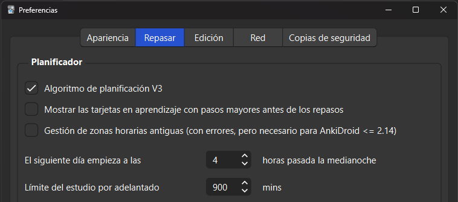

# Día 4

Hoy vamos a dar un paso muy importante en nuestro aprendizaje. Vamos a aprender a utilizar **Anki**. Anki es un programa que, mediante un algoritmo de repetición espaciada, nos **enseñará palabras y vocabulario** para que vayamos aprendiendo japonés, y lo más importante, para que no se nos vaya olvidando.

El día de hoy va a consistir en:

- Practicar kana
- Estudiar gramática
- Usar Anki por primera vez
- Aprender nuevas palabras y kanjis en Anki
- Configurar un teclado japonés en tu ordenador
- Hacer tu inmersión diaria.

**Vas a necesitar bastante tiempo** así que procura tener, por lo menos, digamos 2 horas para poder acabar de poner todo en orden.
En tu viaje (de sólo ida ya que jamás lo vas a dejar) vas a tener días donde te vas a dedicar a poner cosas a punto, pero vale la pena créeme. No sé por qué pero la mayoría de personas que quieren aprender japonés resulta que son todos ingenieros informáticos, con lo cual han hecho miles y miles de **recursos para que el aprendizaje sea MUY cómodo**. Es el idioma que más recursos tiene para aprender.

## Repaso de kanas

**En primer lugar**: [Practica los kanas](https://gohoneko.neocities.org/learn/kana): hasta que termines con la última tabla. Ya has repasado todas las tablas, a partir de ahora será repasarlas 10 minutos cada día hasta que no necesites repasar más.

[Cronómetro de 10 minutos](https://www.online-stopwatch.com/timer/10minutes/)

## Gramática

Después, **haz tu estudio diario de gramática**. Recuerda la rutina del día anterior. 2-3 vídeos o 1-2 lecciones de Tae Kim.

## Empieza Anki

Ahora vamos a configurar Anki. Pero con el objetivo de ahorrarme explicarte durante horas algo, mejor mira el siguiente vídeo

???+ tip "Anki: La regla #1 de Anki"

    <iframe width="560" height="315" src="https://www.youtube.com/embed/UDUITtA1jJI" title="YouTube video player" frameborder="0" allow="accelerometer; autoplay; clipboard-write; encrypted-media; gyroscope; picture-in-picture; web-share" allowfullscreen></iframe>

### Instalación

{width="500" align=right}
Procedemos a descargar Anki. Puedes descargar Anki visitando el [sitio web oficial](https://apps.ankiweb.net/) y haciendo clic en el botón Descargar. Debería dirigirte a la sección de descargas. Haz clic en la primera opción.

Vamos a necesitar **un mazo de cartas** (digitales), el enlace es el siguiente: [Google Drive](https://drive.google.com/u/0/uc?id=1A4pwUf22heVIKah_RlHBMsZLOojKBtik&export=download)

Este mazo consiste en **1000 palabras que necesitas saber para aprobar el N5**. Pero es que además se presentan en un orden bastante peculiar, en el cual solo usa palabras que ya has visto antes para enseñarte nuevas. Con lo cual siempre te enseña sólo una palabra nueva en cada carta (hay un par de excepciones pero no pasa nada).

Curiosamente las cartas del mazo son **oraciones**, no palabras. Es decir, te enseñará las palabras dentro de oraciones de ejemplo. Esto es bueno porque **las personas nos comunicamos con oraciones** y además puedes ir interiorizando también la gramática simple que se va enseñando.

### Configuración

Vamos a proceder a configurar Anki. Cuando abras Anki por primera vez, lo primero que verás es el "selector de idioma de la interfaz". Esto sólo decide en qué idioma se mostrará Anki. Cualquier idioma es válido, pero nosotros elegiremos Español.

{width="500" align=right}

Haz clic en **Herramientas** en la barra superior, y posteriormente en **Preferencias** (o usa el acceso directo de Ctrl+P). En esta ventana, haz clic en la pestaña **Repasar**, y marca (✓) la opción **Algoritmo de planificación V3**, además, modifica **Límite del estudio por adelantado** a **900**. Ya puedes hacer clic en "Cerrar".

En Anki, hay 3 botones en la parte inferior de la ventana. El botón **Importar archivo** es la forma con la que importarás [el mazo descargado anteriormente](https://drive.google.com/u/0/uc?id=1A4pwUf22heVIKah_RlHBMsZLOojKBtik&export=download). Una vez pulsado, se abrirá la ventana de selección de archivos.  
Elige el mazo, seguramente esté en tu carpeta de Descargas. Cuando termine de importarse debería mostrarte una ventana con un montón de texto. Pulsa **OK**, no tienes por qué hacer nada aquí.

Ahora verás la baraja y un número azul al lado. **El número azul es la cantidad de cartas nuevas que harás en un día**. 20 cartas es el valor por defecto.

### Preparando el mazo

Vamos a trastear con las opciones del mazo.  
En primer lugar, 20 cartas considero que es la cantidad normal que deberías hacer. Si con el paso del tiempo ves que son demasiadas, podrás bajarlo a 15, o incluso a 10 si te parece. Pero por ahora **dejémoslo en 20**.

Vamos a hacer click en el **icono del engranaje junto al mazo de Tango**, tienes que poner el ratón encima para que aparezca. Después le daremos a **opciones**. En la parte de límite diario, debe de aparecer 20, lo dejamos así (si sale 30, cambiadlo a 20).  
En **Repasos máximos/día**, vamos a poner **9999**. Esto no significa ni de lejos que vayas a repasar tantas, pero el valor por defecto puede quedarse corto en el futuro, así que mejor dejarlo en **9999**. No queremos interferir con el algoritmo de Anki, así que si algo te sale para estudiar hoy, que lo tengas que estudiar hoy.

{width="500" align=right}

En **pasos en la etapa de aprendizaje** vamos a dejar **1m 10m**. Luego definiremos **orden de inserción** como **secuencial (las más antiguas primero)**. En la sección de **Olvidos**, en los **pasos de reaprendizaje** debe aparecer **10m**.

En **umbral para sanguijuelas** con que pongamos **5** está OK. Además debe estar elegido **suspender tarjeta** en el apartado de **acción para sanguijuelas**.

En la sección Orden de visualización, cambia el orden Nuevos/revisiones a Mostrar antes de las tarjetas para revisar. Ahora haremos clic en Guardar.

### Comenzar el estudio

En cuanto a cómo empezar a estudiar el mazo, es muy fácil. Haremos **click en el nombre del mazo**, y luego le daremos a **Comenzar a estudiar**.

Lo que veremos a continuación es la primera carta. La primera carta es bastante sencillita, y es la siguiente frase:  
`私はアンです。`  
Bien, aquí vamos a empezar a utilizar algo de conocimiento que hemos adquirido. El hiragana y katakana que ya hemos adquirido de los ejercicios va a hacernos falta. Luego el です del final seguramente también lo hayas visto en tu estudio de gramática, junto la は que también debería sonarte.  
Entonces lo único que nos queda de aquí que no conocemos es **私「わたし」**, pues esta es la palabra que estamos aprendiendo en esta carta. <u>Yo</u> soy Ann.

Si le damos a **descubrir** en la carta, veremos que nos sale la frase con hiragana encima (encima del 私 debe aparecer わたし, a esto se le llama **furigana** y sirve para ver las lecturas de los kanjis). Justo a continuación pondrá la traducción en español, y finalmente, la palabra que hiragana y su traducción. Cuando descubramos la carta además escucharemos un sonido, que es el de un nativo leyendo la frase.

Lo que se espera de ti es que cuando veas esta cara en el futuro sepas hacer dos cosas: Saber **leer** y **entender** la oración. En este caso debes leer mentalmente, o en voz alta si prefieres pero no hace falta, わたし　は　アン　です, y saber que dice “Yo soy Ann”.

Y ya está. Como estás viendo por primera vez esta carta y no conocías, lógicamente, el significado y las lecturas, le vas a dar a **Otra vez** (puedes obviar los botones de fácil y difícil, sólo están para molestar).

Cuando le des a **otra vez**, Anki entenderá que no conoces esta carta y te la mostrará de nuevo en 1 minuto. Pero mientras, te enseñará otras cartas. Intentaremos también aprendernos la siguiente carta, le daremos a **otra vez**, y así hasta acabar con nuestro cupo diario de 20 cartas.

Cuando empiecen a repetirse todas estas a las que le demos **otra vez**, solo si sabemos leerlas y entenderlas le daremos a **bien**. Una vez le demos una vez a **bien**, aparecerá de nuevo en 10 minutos. Si en 10 minutos todavía sabemos leerla y su significado, aparecerá el día siguiente y por hoy habrás terminado de verla.  
¿Te has fijado que cuando das click a _otra vez_ el número rojo de la barra de abajo ha pasado de 0 a 1? Esa es la pila de cartas en **otra vez**. Las azules son las nuevas y las verdes son las que hay pendientes por revisar en el día de hoy (se actualizará cada día).

Si mañana la sabes leer y así lo indicas, aparecerá dentro de 4 días, luego de 9 días, 15, etc… Y si no la recordamos, volverá a mostrárnosla, con lo cual reforzaremos todas esas que no recordamos.

Para fortalecer un poco el lenguaje de Anki, lo que aparece en el anverso de cada carta se conoce como el **front** (solo la frase, la cual intentamos leer e intentar entender el significado). Cuando mostramos el reverso, eso es el **back**. También puedes mostrarlo mediante la tecla **ESPACIO**. Si vuelves a pulsar el espacio una vez mostrado el reverso, se entenderá como si hubieras dado click a **bien**.

**No por dedicarle mucho tiempo a una carta vas a recordarla mejor**. A veces por fuerza acaban entrando. Al principio cuando ves una carta nueva, estúdiala un ratito pero luego cuando te salga después de haberla fallado no le dediques mucho tiempo para poder hacer más.

Mi método de aprendizaje de tarjetas es (o era, ahora ha cambiado un poco porque soy más avanzado):  
**Paso 1**: Miro la tarjeta.  
**Paso 2**: Reconozco si es una nueva tarjeta o no.  
**Paso 3**: Revelo la parte posterior (Mostrar respuesta) después de darte cuenta de que es una nueva tarjeta.  
**Paso 4**: Leo la lectura o las lecturas de las palabras que no conozco.  
**Paso 5**: Leo el significado.  
**Paso 6**: Deja que el audio se reproduzca, o lo reproduzco de nuevo para que con la información que acabo de obtener, ver cómo la pronuncia el nativo.  
**Paso 7**: Por ahora, presiono “Otra vez”  
**Paso 8**: Los pasos anteriores serán los mismos si la siguiente tarjeta también es una nueva tarjeta pero…  
**Paso 9**: Si la siguiente tarjeta es una que ya he visto antes, pruebo mis conocimientos (lo sabremos si el número de abajo, azul, rojo o verde está subrayado).  
**Paso 10**: Intento recordar el significado y la lectura de la oración.  
**Paso 12**: Revelo la parte posterior.  
**Paso 13**: Me califico a mí mismo dependiendo si el significado y lectura que pensé era correcto.  
**Paso 14**: Normalmente uso el botón Bien si lo he hecho correctamente. Otra vez si no fue correcto.

Después de haber aprendido con éxito 20 cartas, podemos considerar la parte de Anki como finalizada por hoy.

### Últimas consideraciones

Hacer Anki es muy importante, tendremos que encontrar un hueco siempre para hacer por lo menos nuestras **revisiones diarias**. Al día siguiente nos encontraremos con 20 repasos, además de las 20 nuevas que estudiaremos el día siguiente, sumando un total de 40 cartas para estudiar. Llegará un momento en el cual tendrás alrededor de 100 repasos + las 20 nuevas, hasta que termines el mazo. Así que ánimo. A raíz de 20 palabras por día construiremos nuestro vocabulario bastante rápidamente, y verás cómo de repente **¡empezarás a encontrar palabras japonesas por todos lados!**

Y ahora una pequeña ronda de preguntas que puedas tener:

- **P: ¿Debo preocuparme si olvido mucho?**  
   R: No. Anki está hecho para cosas que es probable que olvides. Es muy probable que olvides palabras de un idioma que acabas de empezar a aprender. No sería raro que olvidaras más de la mitad de lo que estudias cada día, **no te ralles**. Simplemente constancia y todo saldrá bien. Hay muchas posibilidades de que olvides estas palabras sin Anki, por eso necesitas seguir usándolo para que, finalmente, puedas aprenderte la palabra.  
   En otras palabras, sigue haciendo Anki. Si esto continúa por un tiempo, entonces es posible que debas reflexionar sobre tu método de hacer Anki.
- **P: Sanguijuelas (Palabras que no se te quedan)**  
  Las sanguijuelas es el término que se le da a las palabras que sigues olvidando una y otra vez. La memoria funciona recogiendo pistas. Cuando las palabras no se adhieren o no se nos quedan significa que hay varios puntos en el ámbito más amplio de la palabra que hacen que tu mente no esté recogiendo ninguna pista.  
  En términos más fáciles de entender, necesitas más o diferente información que la que hay en la tarjeta. Es decir, si no la aprendes ahora no te preocupes, que más adelante la aprenderás. Si te salen alguna que otra sanguijuela al cabo del tiempo, no importa, de verdad.

## Configurando el IME japonés

Ahora configuraremos nuestro teclado para poder escribir kanas. **La escritura es totalmente fonética**. Es decir, escribiremos kore y el teclado nos indicará si queremos escribir これ.  
Mi recomendación es el [IME de Google](https://www.google.co.jp/ime/). Entramos aquí: [Google 日本語入力 – Google](https://www.google.co.jp/ime/) y le damos clic al botón en medio de la pantalla.

Una vez lo tengamos instalado, puede que nos pida reiniciar. Abajo a la derecha, en la barra de herramientas, veremos qué tipo de teclado tenemos puesto, justo a la izquierda de la hora, donde normalmente pone ESP. Si le pulsamos **ALT + SHIFT** nos cambiará al IME Japonés, pero seguramente sea el modo romaji. Para cambiar a hiragana, pulsaremos **ALT + BLOQ SHIFT**, y lo mismo para katakana. Recomiendo que os quedéis en el de hiragana porque si escribís algo en katakana os lo convertirá automaticamente. Una vez escribamos alguna palabra la irá convirtiendo fonéticamente y con espacio podremos elegir entre los kanjis que la tienen como lectura. Podés jugar un rato con las palabras que habéis aprendido hoy en Anki.

## Inmersión

Ahora es la hora de hacer nuestra inmersión diaria.  
Tú eliges cuánto anime consumir. Un par de capítulos está más que bien para un principiante. Si no toleras sin subtítulos entonces serían 2 con subs y los mismos 2 sin subs, lo cual ya es una cantidad más que recomendable.  
Si tienes tiempo, estos días ponte metas de inmersión. Empieza con 30 minutos, después 60 minutos, después 2 horas… El límite te lo pones tú.

!!! note "Nota personal del administrador de Manabe"
    A medio plazo deberías por lo menos inmersar dos horas al día. Si logras 1-2 horas de inmersión pasiva y 2 horas de inmersión activa progresarás a buen ritmo.  
 Para que te hagas una idea, para sacarme el N1 me tiré de media 3 horas/día sólo de inmersión el primer año, los siguientes 6 meses unas 4 horas/día, y los últimos 9 meses unas 6 horas/día. Esta dedicación me permitió aprobar el examen, pero todo depende de la persona, de lo que quiera conseguir y de lo motivada que esté. Otras personas lo han conseguido de una manera más relajada y con bastantes menos horas (y al revés, también), así que depende totalmente del individuo.

  [Pasar al día 5](day5.md){.md-button .md-button--primary}

