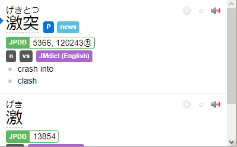
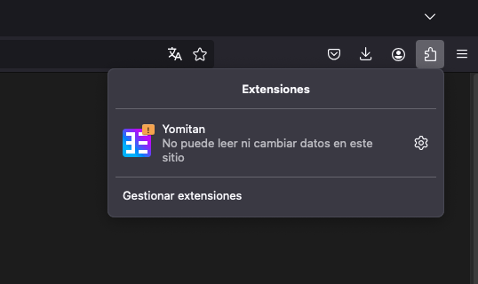
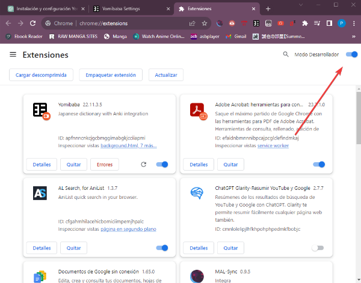
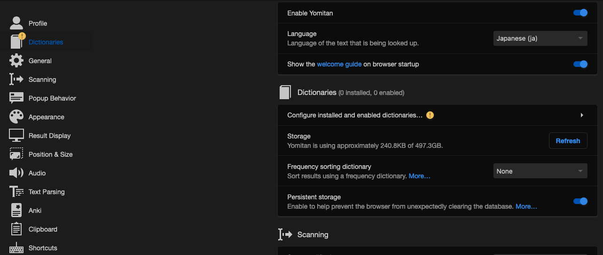
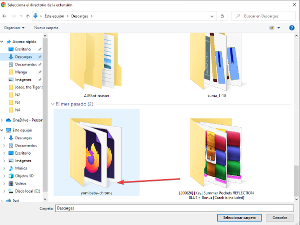
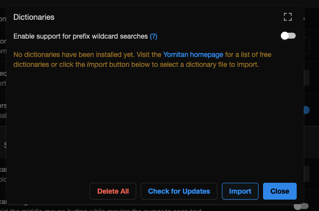
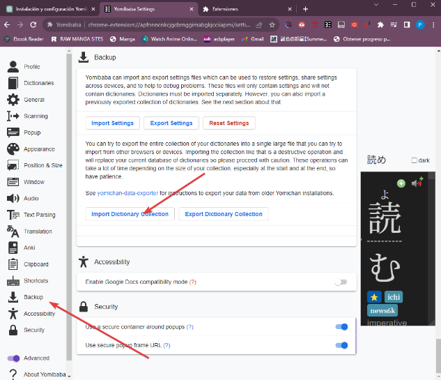
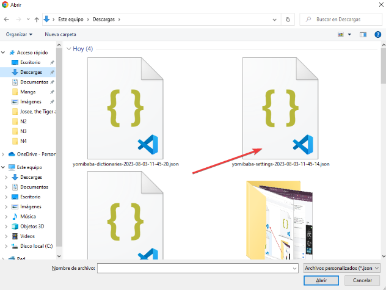
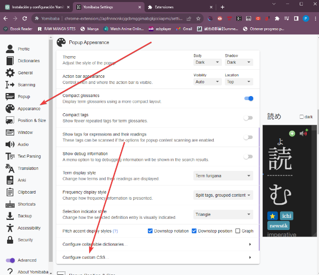

# Día 6

Hoy vamos a **practicar la lectura por primera vez**. Va a ser bastante difícil. Pero no te preocupes si estás muy perdido. ¡Cada ratito cuenta! 

## Repaso de kanas

Primero, practica los kanas durante 10 minutos. Voy a dejar de poner los enlaces porque a estas alturas deberías tenerlos en la barra de marcadores de tu navegador.

## Anki
Después de eso, pasa a hacer tu Anki. Primero las reviews y luego las nuevas.

## Gramática
Después de tu Anki, haz tu sesión de gramática. Dos o tres vídeos de Cure Dolly, o Tae Kim, como tú elegiste.

Esta primera fase debería haberse convertido ya en rutina. Tu día a día con el japonés empieza así, y **está MUY centrado en el estudio casi directo del idioma**. Recuerda, que este estudio NO te va a dar habilidad con el idioma. La habilidad viene con la inmersión. Por mucho que estudies, por mucho que hagas Anki, por mucho que practiques los Kanas, si no saltas a inmersar no vas a entender el japonés. (Recuerda la analogía de: por mucho que leas un libro sobre cómo nadar, hasta que no te lances a la piscina no vas a saber nadar).

## Inmersión
Vamos a empezar a hacer la inmersión más divertida.  
Tu primer contenido de lectura será anime con subtítulos en japonés. Es un poco complicado de configurar, pero vamos a ello.

### Yomichan/Yomibaba
{width="400" align=right}
En primer lugar necesitaremos **Yomichan**. Yomichan es una extensión de nuestro navegador que nos permitirá acceder a la definición de un palabra en japonés pulsando shift y poniendo el ratón encima de esta, nos sacará un desplegable con la entrada del diccionario y el significado de la palabra. Útil y bastante personalizable, además de necesario para nuestro futuro una vez terminemos el mazo del Tango. 🙂

???+ note "Instalación de Yomibaba"
    En el tutorial utilizaremos Yomibaba ya que hace más fácil la instalación de diccionarios

    #### Firefox
    1. Descarga el archivo [yomibaba-firefox-signed-22.11.3.4.xpi](https://github.com/forsakeninfinity/yomibaba/releases/download/22.11.3.4/yomibaba-firefox-signed-22.11.3.4.xpi)
    2. Arrastra el archivo descargado a la ventana de tu navegador Firefox.
        O bien, haz doble clic en el archivo para que se instale automáticamente.
    
    #### Navegadores basados en Chromium (Google Chrome)
    ##### Activa el modo desarrollador
    1. Abre tu navegador.
    2. Dirígete a la ventana de [extensiones](chrome://extensions/).

    

    3. Activa el "modo desarrollador en la parte superior derecha de la página.

    

    ##### Cargar la extensión
    1. Haz clic en el botón "Cargar descomprimida".
    
    

    2. Selecciona la carpeta que descomprimiste anteriormente.

    

    #### Instalar diccionarios
    1. Descarga [este archivo](https://cdn.discordapp.com/attachments/654363913470738462/1136627255561424906/yomibaba-dictionaries-2023-08-03-11-45-20.7z) con los diccionarios de Yomibaba y descomprímelo.
    2. Abre la configuración de Yomibaba.

    

    ##### Importar datos de diccionarios
    1. Dirígete a la sección "Backup" en la configuración de Yomibaba.

    

    2. Selecciona "Import Dictionary Collection".
    3. Busca y selecciona el archivo yomibaba-dictionaries-2023-08-03-11-45-20.json que descomprimiste previamente.

    

    #### Configuración
    1. Descarga [este archivo](https://cdn.discordapp.com/attachments/654363913470738462/1136627255871807538/yomibaba-settings-2023-08-03-11-45-14.json) con la configuración de Yomibaba.
    2. En la misma sección "Backup", haz clic en "Import Settings".
    3. Selecciona el archivo yomibaba-settings-2023-08-03-11-45-14.json que descargaste.

    

    ¡Listo! Ahora tienes Yomibaba configurado con tus diccionarios y ajustes.

???+ tip "Cambiar la fuente de Yomibaba"
    #### Cambiar la fuente
    Si deseas cambiar la fuente en Yomibaba, sigue estos pasos:
    1. Abre la sección "Configure custom CSS..." dentro de la configuración de Yomibaba.

    

    2. Pega el siguiente código al final de "Popup CSS", reemplaza el valor **font-family** con la fuente que quieras utilizar.
    ```css
    .kanji-link {
      font-family: Noto Serif JP;
    }

    .source-text {
      font-family: Noto Serif JP;
    }

    .gloss-content {
      font-family: Noto Serif JP;
    }

    .tag-label-content {
      font-family: Noto Serif JP;
    }
    ```
    
    

### ASBPlayer
Una vez instalado Yomichan o Yomibaba, utilizaremos ASBPlayer para poder incrustar subtítulos a nuestros vídeos. Además lo bueno de ASBPlayer es que puedes usar vídeos online, lo cual es la hostia.

Bien, para instalarlo hacemos click [aquí](https://github.com/killergerbah/asbplayer/releases)  
Una vez ahí, veréis un enlace donde podremos descargar la versión actual, es el enlace que está subrayado en azul. Para ver el enlace hay que bajar un poco a la sección de **Installation**.

Una vez descargado, lo descromprimiremos en una carpeta de nuestro PC. Recordad donde lo ponéis, yo lo he descomprimido en una carpeta que se llama ASBPlayer en mi unidad C.

Ahora iremos a **chrome://extensions** o **edge://extensions** (según el navegador que queráis usar) y activaremos el modo para desarrolladores (mismo proceso que con Yomibaba). Una vez hecho eso, le daremos a **cargar desempaquetado** y ahí elegiremos la carpeta en la que descomprimimos el archivo descargado anteriormente (La mía es ASBPlayer). Una vez hecho eso, reiniciamos nuestro navegador y voilà. Ya tenemos el reproductor listo.

Ahora sólo necesitamos dos cosas. Un vídeo que ver y unos subtítulos.  
Para vídeos tenemos la web de [Aniwatch](https://aniwatch.to/tv). Esta web tiene todo lo que vayas a necesitar, pero puede que valga también alguna otra que conozcas. Yo uso esta porque permite quitar los subtítulos en inglés que vienen con el vídeo, y dejarlo sin subtítulos (los cuales añadiremos nosotros con ASBPlayer). 

Por ejemplo, yo voy a buscar "One Piece" y pondré el capítulo 1.

Ahora buscaré mis subtítulos. Los subtítulos los deberías poder encontrar en [Kitsunekko](https://kitsunekko.net/dirlist.php?dir=subtitles%2Fjapanese%2F). Bajamos hasta encontrar "One Piece" (podéis hacer **ctrl+f** para buscar). Descargamos el primer capítulo, o algún pack de subtítulos, y descomprimimos en algún lugar de nuestro ordenador.

Una vez abierto el capítulo en cuestión, arrastramos a la ventana del reproductor de vídeo de la página web el archivo .srt de subtítulos del primer capítulo y vemos si es adecuado. Nos deberá de abrir otra pestaña, con todos los subtítulos cargados.

En mi caso está ocurriendo una cosa bastante común que seguramente os pase con muchos otros animes, y es que ¡los subtítulos están desincronizados! Pero es muy fácil sincronizarlos.

Vamos a hacer lo siguiente: cubriendo la mitad pantalla pondremos el capítulo de one piece. Al otro lado pondremos la ventana con los subtítulos, así en la pantalla sólo veremos el vídeo y el historial de subtítulos. Según reproduzcamos vamos a ver que hay una voz que habla, pero que los subtítulos no avanzan. De hecho si nos fijamos, vemos que los subtítulos salen en el segundo 17 del archivo de subtítulos, sin embargo, la voz aparece a los dos segundos de iniciar el vídeo, con lo cual tendremos que retrasar 15 segundos el archivo de los subtítulos para que vayan a la par. 

¿Cómo hacerlo? Muy fácil, en la pestaña donde aparecen todos los subtítulos vemos que abajo hay un símbolo de más (+) y otro menos (-) para poder rectificar los subtítulos. Escribimos "-15", le damos a **enter** y volvemos a iniciar el vídeo.


Así estaría perfecto.  
Seguramente para todos los capítulos de Aniwatch necesitaremos ajustar a -15 los subtítulos, lo cual no es problema una vez le cogemos el truco. Nadie dijo estudiar japonés fuera fácil 😉.

Una vez sincronizados, podemos usar Yomibaba y leer todas las palabras que van apareciendo en los subtítulos dentro de la misma ventana del vídeo. No necesitamos la otra ventana para nada, de hecho la podemos cerrar.

### ¿Cómo se "lee" un anime?
Bien, ahora que estamos listos, ¿cuál sería la manera de proceder con este tipo de inmersión?  
Vale, aquí os puedo decir dos maneras de hacerlo.

- La primera es ver el anime con **los subtítulos en la pantalla**, intentando seguir con los ojos TODO lo que se está diciendo. Lógicamente aparecerán un montón de kanjis de los cuales no conoceréis su lectura, pero vais a ver un montón de hiragana y un montón de katakana, con lo cual os permitirá asociar sonidos de palabras con el silabario.

- Podéis, además, utilizar Yomibaba para ver el significado de alguna palabra que os haya llamado la atención. ¿Sois capaces de entender alguna frase? ¿Sois capaces de medio entender alguna frase sencillita si pausáis el vídeo y comprobáis el significado de alguna palabra?

Pero no os recomiendo mirar más de 20-30 palabras durante todo el anime, tenemos que ver más cosas para poder seguir exponiéndonos al japonés.

Una vez visto el capítulo, podéis repasar y hacer un ejercicio de lectura volviendo a abrir (arrastrando los subtitulos al vídeo) la pantalla secundaria que sale con la lista de subtítulos, y dedicandoos a leer TODO el rato esa pantalla mientras hablan los personajes.

Yo sólo seguí la primera manera debido a que me parecía algo aburrido rever capítulos dos veces siempre, pero no me parece para nada un mal repasar el capítulo e ir leyendo todo ya que, al haberlo visto una vez, tenemos un contexto primordial para ir entendiendo cositas.

Os lo dejo a vuestra elección. A este tipo de inmersión la vamos a llamar **leer subtítulos**. Y es una inmersión basada principalmente en la lectura, pues tiramos mucho de los subtítulos para entender las cosas. Este tipo de inmersión os valdrá bastante porque os permitirá, durante mucho tiempo, comprobar el significado de las palabras y en el futuro hacer cartas en Anki.

Recomiendo además seguir con el mismo anime durante un tiempo, ya que las palabras se repiten bastante, y las entenderemos mejor que cambiando de animes. 

Intentad cada día leer por lo menos un capítulo de lectura y ver un capítulo sin nada de subtítulos, centrándonos en los sonidos y las palabras, intentando reconocer cosas sin parar. Un capítulo al día de cada está bien para empezar, si tenemos mucho tiempo, tres capítulos de lectura y otros tres sin subs también estaría bien, pero no nos quememos. 

El método del **tutor de los subtítulos** ([El visto durante el día 2](day2.md)) lo podemos sustituir por este, ya no es necesario y realmente se trataba de un pequeño aliciente para acostumbrarnos a inmersar. 


<div style="margin-top: 20px;width:full;display:flex;justify-content:center;">
  <a style="padding: 10px;
    background-color: var(--md-primary-fg-color);
    border-radius: 5px;
    color: white;" href="/days/day7/">Pasar al día 7</a>
  </div>