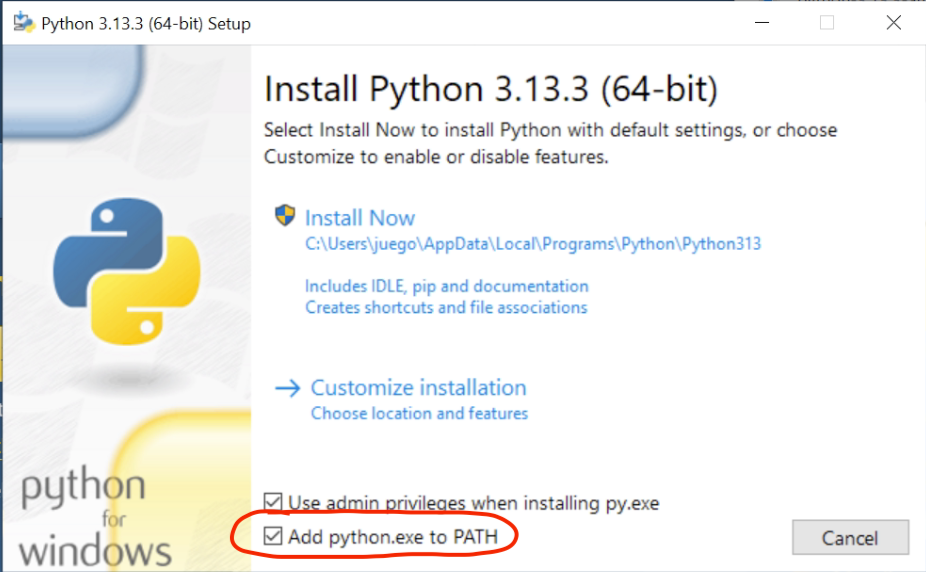
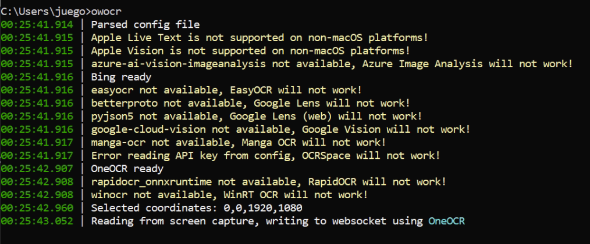
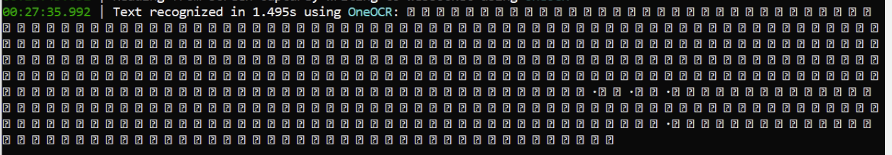
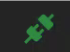

# Cómo extraer texto de novelas visuales

Uno de los mejores medios para aprender japonés son las novelas visuales, con ellas mejoras tanto tu capacidad de lectura como la de escucha sin ser tan complicadas como lo sería un audiolibro, ya que están acompañadas de imágenes que proveen contexto sobre lo que ocurre.

La desventaja que tiene este medio es que el consultar palabras no te es tan sencillo como lo sería en una novela corriente, en esta guía voy a explicar un método para extraer el texto de una novela visual y poder ahí consultar palabras o contar la cantidad de caracteres que has leído para llevar un seguimiento de tu estudio.

???+ tip "Respecto a extraer texto de VNs con hooks"
    Como muchos ya saben, habitualmente se utilizan programas como Textractor o Agent para extraer el texto de novelas visuales. Ya existen muchas guías al respecto y este método no funciona para algunas novelas visuales, por ello voy a dedicar esta página únicamente a un método basado en el OCR.
    
    Si por alguna cuestión quieres utilizar uno de los programas mencionados puedes consultar [esta guía](https://learnjapanese.moe/vn/#playing-visual-novels-to-learn-japanese) en inglés que explica como hacerlos funcionar

## Introducción
Para extraer el texto vamos a utilizar un programa llamado [OwOCR](https://github.com/AuroraWright/owocr){:target="_blank"}, este programa es un módulo de Python que utiliza OCR para analizar el texto que se ve en la pantalla de tu ordenador de forma que luego puedas servirte de él, en esta guía voy a explicar desde el principio cuál es el proceso para instalarlo y utilizarlo para extraer texto de una novela visual.

## Pasos de instalación de OwOCR

### 1. Instalar Python
- El primer paso es instalar una versión de Python superior a 3.11 en tu ordenador, esto lo podéis conseguir en [este enlace](https://www.python.org/downloads/){:target="_blank"} que dirige a la página oficial para descargar la última versión disponible de Python.

- Una vez descargado el instalador, ejecutarlo y asegurarse de marcar la opción de añadir Python a la variable de entorno PATH, esto es importante para que luego funcione correctamente. 
{width="500"}

- Sigue el proceso de instalación y asegúrate de que no haya errores, si todo ha ido bien ya tienes Python instalado en tu ordenador.

### 2. Instalar OwOCR
- Una vez tengamos Python instalado en el ordenador ahora toca añadir el módulo de OwOCR. Para ello tendrás que abrir la consola de comandos, puedes hacerlo buscando cmd en el menú de inicio de Windows o utilizando la combinación de teclas `Windows + R` y escribiendo `cmd` en la ventana que se abre.

- Ahora dentro de la consola tendrás que instalar el módulo de OwOCR, esto se hace con el gestor de paquetes de Python llamado pip. Para ello escribe el siguiente comando en la consola:
```bash
pip install owocr
```

- Cuando vuelva a salir el cursor para que escribas, y si hay mucho texto blanco, significará que se ha instalado correctamente, si no es así revisa el error que te da y asegúrate de que tienes Python instalado correctamente y que pip está en la variable de entorno PATH.

### 3. Instalar un modelo de OCR
OwOCR tiene una buena cantidad de modelos de OCR disponibles para funcionar, en esta guía solo voy a explicar los que recomiendo, pero si tienes curiosidad por los demás puedes verlos en su [github oficial](https://github.com/AuroraWright/owocr?tab=readme-ov-file#local-providers){:target="_blank"}. A continuación explicaré las diferentes opciones que puedes elegir utilizar según con lo que cuentes:

??? info "Windows (10 o superior)"
    Si tienes un entorno windows deberías utilizar OneOCR, es el modelo que utiliza Windows para su herramienta de recortes y el que mejor funciona en este caso. Para configurarlo para owocr simplemente deberás instalar el módulo de OneOCR para OwOCR con el siguiente comando, pero antes de ello deberás descargar algunos archivos necesarios.
    
    - Estos archivos que necesitas están contenidos en la herramienta de recortes de Windows 11 así que deberás descargarla y extraer lo que necesitas de ella.
    
      - Puedes descargarla, por ejemplo, en [esta página web](https://store.rg-adguard.net/){:target="_blank"} utilizando el link de la app que es `https://apps.microsoft.com/detail/9mz95kl8mr0l` y la opción de Fast, de los resultados que te dé deberás descargar el archivo con extensión .msixbundle más reciente que haya, es decir, el que tenga el número de versión más alto.
    
      - Una vez lo descargues deberás reemplazar la extensión .msixbundle por .zip y extraer sus contenidos, dentro podrás encontrar varios archivos con extensión .msix, encuentra el que no contenga el texto "language" y coincida con la arquitectura de tu windows (si no sabes cuál es, probablemente es x64). De la misma forma que has hecho con el otro archivo, reemplaza la extensión .msix de este archivo por .zip y extrae su contenido.
    
      - Dentro de este archivo podrás ver algunas carpetas, entra dentro de "SnippingTool" y ahí verás los 3 archivos que necesitas: "oneocr.dll", "oneocr.onemodel" y "onnxruntime.dll"; copia los 3 archivos.
    
      - Ahora deberás dirigirte a la carpeta de configuración de OwoCR, esta está en `C:\Users\tu_usuario\\.config`, crea una carpeta llamada "oneocr" y dentro de ella pega los 3 archivos que has copiado antes. Si no ves la carpeta .config es porque está oculta, puedes ver las carpetas ocultas en el explorador de archivos de Windows activando la opción "Elementos ocultos" en la pestaña de "Vista".

      - Habiendo hecho esto ya podrás instalar el módulo de OneOCR para OwOCR con el siguiente comando:
      ```bash
        pip install owocr[oneocr]
        ```

??? info "MacOS"
    Si tienes MacOS te alegrará saber que Apple cuenta con un modelo de OCR bastante bueno y en el cual no tienes que instalar nada, puedes pasar al siguiente paso.

??? info "Otros sistemas o ninguno de los métodos de arriba me funciona"
    Si usas otro sistema operativo o usas uno de los de arriba, pero por lo que sea no te funcionan, puedes utilizar un modelo en la nube, es decir, es otro el que hace el OCR por ti y tú solo le mandas las imágenes. En este caso te recomiendo el de Google Lens, ya que es rápido y bastante fiable. Para instalarlo simplemente ejecuta el siguiente comando:
    ```bash
    pip install owocr[lens]
    ```

    La desventaja de este método es que al ser un modelo en la nube, necesitarás conexión a internet para utilizarlo y puede que tarde un poco más en procesar las imágenes. En caso de que tu ordenador sea antiguo puede ser que este método sea más rápido que los demás, ya que no tendrás que utilizar la GPU de tu ordenador para procesar las imágenes.

### 4. Configurar OwOCR
Ya lo tienes todo listo para utilizar el OCR, lo único que falta es preparar los ajustes para que funcione como tú quieres que lo haga, estos ajustes se pueden modificar en el archivo de configuración que está en la carpeta de configuración de OwOCR, que se encuentra en `C:\Users\tu_usuario\\.config\owocr_config.ini` si no existe este archivo, ejecuta el comando `owocr` en la terminal y ciérralo (tecla 'q') para que se genere automáticamente. Ábrelo con tu editor de textos favorito y ahora te digo qué opciones son las que te importan, todos los ajustes de este archivo de configuración tienen un ";" al principio que sirve para desactivarlos **recuerda quitar el punto y coma de todos los que modifiques**.

- La primera decisión que tienes que tomar es el **<u>modelo que quieres usar</u>**, en la segunda línea tienes una lista con todos los modelos disponibles, copia el alias del que hayas instalado en el paso anterior y ponlo en la siguiente línea que debería decir `;engine = `, pon el alias después del igual y **quítale el punto y coma del principio**.

- El siguiente punto a mirar es **<u>de donde va a obtener OwOCR las imágenes</u>**, hay varios métodos disponibles, pero el que nos interesa es el que hace capturas a la pantalla, para ello busca la línea que dice `;read_from = ` y ponle el valor `screencapture` **y quítale el punto y coma del principio**.

- El siguiente punto es determinar **<u>a dónde enviará OwOCR el texto</u>** que extraiga de las imágenes, hay dos opciones que te interesan: clipboard, que es copiar el texto de la imagen para que tú puedas pegarlo; o websocket, que es una solución más sofisticada que consiste en un servidor local que envía el texto a otro programa. Si quieres usar el método de clipboard, busca la línea que dice `;output = ` y ponle el valor `clipboard`. Si quieres usar el método de websocket, ponle el valor `websocket` **y quítale el punto y coma del principio**.

    Más adelante explicaré cómo configurar la web donde pegar el texto, tanto como para la opción del portapapeles como para la de websocket.

- El siguiente punto es exclusivo de Windows, consiste en **<u>determinar el área que usará OwOCR para hacer las capturas</u>**. Por defecto al iniciar OwOCR se ejecutará un programa que permite seleccionar tú mismo el área de la pantalla del que quieras que se hagan capturas (útil si por ejemplo solo quieres que haga capturas del área donde aparece el texto de la novela visual). Si bien esta forma tiene sus ventajas, tiene la gran desventaja de que eres tú el responsable de determinar el área cada vez que abras el owOCr. Si prefieres un método más simple puedes buscar la línea que dice `;screen_capture_area  = ` y ponerle el valor de screen_1 (o sustituir el 1 por el número de tu monitor si tienes varios), de esta forma las capturas se harán de toda la pantalla y no tendrás que preocuparte de seleccionar el área cada vez que abras el programa. **Recuerda quitarle el punto y coma del principio**.

- El siguiente punto importante es determinar **<u>cómo se harán estas capturas de pantalla</u>**, hay dos formas de hacerlo: o bien configuras que al pulsar una tecla se haga la captura o bien configuras un temporizador para que cada x tiempo se haga una captura. 

    Personalmente recomiendo configurar la tecla de captura y poner la misma tecla que utilice la novela visual para avanzar de línea, de esta forma harás las capturas siempre que saltes de línea y no te tendrás que preocupar por líneas duplicadas. Para ello busca la línea que dice `;screen_capture_combo  ` y ponle el valor de la tecla que quieras usar, por ejemplo `screen_capture_combo = <space>` para usar la barra espaciadora (puedes ver los códigos de todas las teclas de tu ordenador [en esta página](https://pynput.readthedocs.io/en/latest/keyboard.html#pynput.keyboard.Key){:target="_blank"}), las combinaciones de teclas se unirán usando "+". **Recuerda quitarle el punto y coma del principio**.

    Si este método no te gusta o no puedes usarlo, puedes configurar un temporizador para que cada x tiempo haga una captura. Para ello busca la línea que dice `;screen_capture_delay_secs   ` y ponle el valor de la cantidad de segundos que quieras que pase entre captura y captura, por ejemplo `screen_capture_delay_secs  = 5` hará que cada 5 segundos haga una captura. **Recuerda quitarle el punto y coma del principio**.

Al configurarlo todo ya podrás guardar el archivo de configuración y cerrarlo, ya tienes todo listo para utilizar el OCR.

### 5. Ejecutar OwOCR
Para ejecutar OwOCR simplemente abre la consola de comandos y ejecuta el siguiente comando:
```bash
owocr
```

Con esto debería cargar sin problemas y aparecer una pantalla parecida a esta
{width="500"}

Puedes verificar si funciona correctamente poniendo un texto en japonés en el área de captura de OwOCR que hayas configurado y pulsando la tecla o esperar el tiempo que hayas determinado, en caso de funcionar te saldrá un log con el texto que has extraído y lo copiará al portapapeles o lo mandará por websocket según tu configuración.

{width="500"}

En mi caso no se ve el texto japonés porque no tengo una fuente instalada que lo soporte, pero esto es prueba de que funciona y si se te ve igual puedes estar tranquilo.

### 6. Configurar la web para pegar el texto
Muy bien, ya tienes el OCR funcionando y el texto se manda donde se tiene que mandar, ahora lo que queda es configurar una página que recoja este texto y lo pegue para que puedas consultar palabras o ver cuántos caracteres has leído. Para ello vamos a utilizar [esta página web](https://hook.manabe.es/){:target="_blank"} que cumple el propósito perfectamente.

???+ tip "Ajustes a considerar sobre la página"
    Antes de pasar a explicar como conectar OwOCR con la página, hay algunas configuraciones que debería explicar.

    Si das click al engranaje de la parte derecha de la página se abrirá un menú de configuración, aquí hay varias configuraciones que deben ponerse adecuadamente o de lo contrario podrías pensar que la página no funciona adecuadamente:

    Por defecto la página está configurada para ignorar todos los datos que le lleguen si el cronómetro no está activo, esto puede causar que no se copien líneas porque se te ha olvidado activarlo. 

    Los ajustes de "Allow new Line during Pause" y "Allow Paste during Pause" permitirán que aunque el cronómetro esté desactivado se copien líneas. 

    Otra opción es marcar los ajustes de "Autostart Timer by Paste during Pause" y "Autostart Timer by Line during pause", de esta forma al pegar texto o al recibir una línea se activará el cronómetro automáticamente y la línea no será ignorada.

??? info "Estoy usando la opción de clipboard en OwOCR"
    Si estás usando este ajuste para OwOCR necesitarás instalar una extensión llamada Clipboard Inserter [[Chrome](https://chromewebstore.google.com/detail/clipboard-inserter/deahejllghicakhplliloeheabddjajm){:target="_blank"} | [Firefox](https://addons.mozilla.org/en-US/firefox/addon/lap-clipboard-inserter/){:target="_blank"}], lo que hace esta extensión es analizar todo el texto que pase por tu portapapeles y plasmarlo tal cual en la página.

    Una vez instales la extensión tendrás que dirigirte a [la página donde se pega el texto](https://hook.manabe.es/){:target="_blank"} y activarla en la barra superior. Al darle click el icono debería cambiar y poner un "ON"

    

    Tras hacer esto deberás abrir el menú de configuración de la página y marcar el ajuste de "Enable external Clipboard Monitor", puedes comprobar si funciona copiando cualquier texto y viendo si aparece en la página.

??? info "Estoy usando la opción de websocket en OwOCR"
    Si estás usando este ajustes para OwOCR no necesitas instalar ninguna extensión, simplemente confirma que tengas OwOCR abierto y abre el menú de configuración de [la página donde se pega el texto](https://hook.manabe.es/){:target="_blank"}, ahí modifica la dirección de "Primary Websocket" a `ws://localhost:7331` y pulsa el icono rojo que hay en la parte superior, si se pone verde sabrás que funciona correctamente.

    

### 7. Abre la novela visual y a inmersar
Una vez tengas el OwOCR abierto y la página donde se copia el texto lista, podrás abrir la novela visual sin tener que preocuparte de otros programas ni nada que esté abierto y jugar sin preocupación. En caso de que hayas configurado el temporizador se hará una captura de pantalla cada X segundos, se analizará el texto que contenga y se enviará a la página web, en caso de que hayas configurado la tecla de captura, cada vez que pulses esa tecla se hará una captura y se enviará el texto a la página web.

Dentro de la página web podrás utilizar yomichan u otra herramienta para consultar palabras japonesas y debería funcionar perfectamente.

Si tienes alguna duda o has tenido algún error no dudes en preguntar [en nuestro servidor de Discord](https://discord.gg/y8P7mpDTcB){:target="_blank"} y te ayudaremos sin problema.