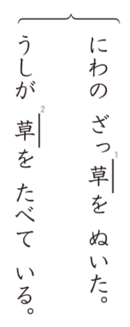
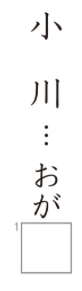
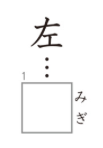
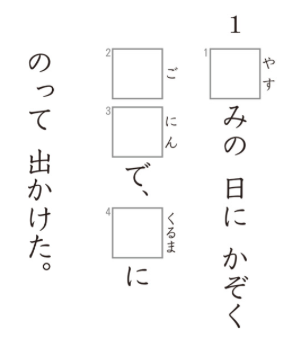

# Preguntas del Kanken 10級

## 1. Lectura de palabras
**Enunciado oficial:** つぎの　ぶんを　よんで、ーせんの　かん字の　よみがなをーせんの　みぎに　かきなさい。

**Traducción:** Lee las siguientes oraciones y escribe la lectura en kana del kanji subrayado a la derecha de la línea.

**Explicación:** En este ejercicio te mostrarán un par de oraciones con varios kanjis subrayados y con un número al lado. Tendrás que escribir **como se lee el kanji** en el contexto de esa oración. La lectura debe ser escrita en hiragana.

¿Cuáles serán las respuestas?

Las respuestas son las siguientes:
18. ちい
19. かい
20. ひと

## 2. Identificación de trazos
**Enunciado oficial:** つぎの　かん字の　ふとい　ところは　なんばんめに　かきますか。〇の　なかに　すう字を　かきなさい。

**Traducción:** ¿En qué orden se escribe la parte gruesa del siguiente kanji? Escribe el número dentro del círculo.

**Explicación:** Como bien sabrás, los kanjis tienen un orden establecido para ser dibujados trazo por trazo, en este ejercicio lo que te piden es que siendo el primer trazo "1", el segundo "2" y así sucesivamente, indiques **en que posición estaría el trazo señalado con negrita** en el kanji.

¿Cuál será la respuesta?

La respuesta es 4.

## 3. Diferentes lecturas del mismo kanji
**Enunciado oficial:** つぎの　ぶんを　よんで、ーせんの　かん字の　よみがなをーせんの　みぎに　かきなさい。

**Traducción:** Lee las siguientes oraciones y escribe la lectura en kana del kanji subrayado a la derecha de la línea.

**Explicación:** Este ejercicio es esencialmente igual que el primero, pero en este caso te mostrarán un mismo kanji en dos oraciones diferentes y tendrás que escribir **la lectura correcta para cada contexto**.

¿Cuáles serán las respuestas?

Las respuestas son las siguientes:
1. そう
2. くさ

## 4. Elegir lectura correcta de kanji
**Enunciado oficial:** つぎの　ことばの　よみがなで　ただしいほうの　ばんごうに　〇を　つけなさい。

**Traducción:** Elige la lectura correcta de las siguientes palabras.

**Explicación:** En este ejercicio te mostrarán varias palabras escritas en kanji y 2 posibles lecturas para cada una. Tendrás que elegir **la lectura correcta** de cada palabra.

¿Cuál será la respuesta?

La respuesta es 2.

## 5. Completar lecturas de kanji
**Enunciado oficial:** 囗に　ひらがなを　いち字　かいて、つぎの　ことばの　よみを　答えなさい。

**Traducción:** Completa las lecturas de los siguientes kanjis con un caracter hiragana.

**Explicación:** En este ejercicio te mostrarán varias palabras escritas en kanji y su lectura con uno o varios espacios en blanco, tendrás que escribir **el caracter hiragana que falta** para completar la lectura correcta de cada palabra.

¿Cuál será la respuesta?

La respuesta es わ.

## 6. Palabras relacionadas
**Enunciado oficial:** つぎの　囗の　なかに　かん字を　かきなさい。

**Traducción:** Escribe el kanji dentro de cada caja.

**Explicación:** En este ejercicio te mostrarán varias palabras y un cuadro asociado a cada una con una lectura a su derecha, deberás escribir **una palabra con esa lectura que además esté relacionada con la palabra** que te muestran.

¿Cuál será la respuesta?

La respuesta es 右.

## 7. Kanjis en textos
**Enunciado oficial:** つぎの　ぶんを　よんで、囗の　なかに　かん字を　かきなさい。

**Traducción:** Lee el siguiente texto y escribe el kanji que falta en cada caja.

**Explicación:** En este ejercicio te mostrarán multiples textos con multiples cajas con la lectura de la palabra a la derecha, tendrás que escribir **el kanji que compone esa palabra** en cada caja.

¿Cuáles serán las respuestas?

Las respuestas son las siguientes:
1. 休
2. 五
3. 人
4. 車

## ¡Quiero practicar!
Hemos desarrollado una web con ejercicios basados en exámenes anteriores del Kanken de todos los niveles hasta el 2, puedes acceder a ella [dando clic aquí](https://kanken.manabe.es/).