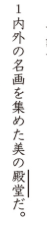
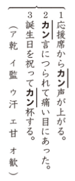
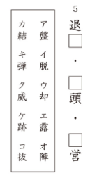
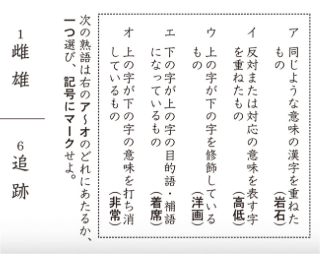
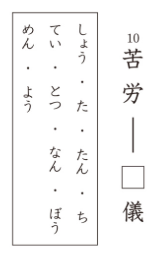
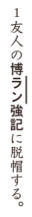

# Preguntas del Kanken 4級 y 3級

!!! note
    Tanto el Kanken 4級 como el 3級 comparten las mismas preguntas, por lo que se han unificado en un solo artículo.

## 1. Lectura de palabras
**Enunciado oficial:** 次のー線の漢字の読みをひらがなで答えのらんに書きなさい。

**Traducción:** Escribe la lectura en hiragana del kanji subrayado en el hueco de la respuesta.

**Explicación:** En este ejercicio te mostrarán multiples oraciones con un kanji subrayado y un número al lado. Tendrás que escribir **como se lee el kanji** en el contexto de esa oración. La lectura debe ser escrita en hiragana.

¿Cuál será la respuesta?

La respuesta es でんどう.

## 2. Palabras con la misma lectura
**Enunciado oficial:** 次のー線のカタカナにあてはまる漢字をそれぞれのア〜オから一つ選び、記号にマークせよ。

**Traducción:** Elige un kanji de entre las opciones A a O que corresponda al katakana subrayado.

**Explicación:** En este ejercicio te mostrarán varios grupos de frases con una parte en katakana subrayada, teniendo en común ambas frases que la lectura del kanji que falta es la misma. Además, tendrás una lista de posibles kanjis para cada grupo. Tendrás que elegir **el kanji correcto** para cada frase.

¿Cuáles serán las respuestas?

Las respuestas son las siguientes:
1. オ（歓）
2. エ（甘）
3. ア（乾）

## 3. Formación de jukugos
**Enunciado oficial:** １〜５の三つの囗に共通する漢字を入れて熟語を作れ。漢字はア〜コから一つ選び、記号にマークせよ。

**Traducción:** Escribe el kanji que es común en las tres cajas de las preguntas del 1 al 5 para formar un jukugo. Elige un kanji de entre las opciones A a E y márcalo.

**Explicación:** En este ejercicio te mostrarán varias columnas cada una con tres palabras incompletas que comparten un kanji en común. Tendrás que completar las palabras escribiendo **el kanji que comparten**. Tendrás una lista de posibles kanjis para todas las columnas del ejercicio.

¿Cuál será la respuesta?

La respuesta es オ（退）.

## 4. Tipos de composición de jukugos
**Enunciado oficial:** 漢字を二字組み合わせたじゅく語では、二つの漢字の間に意味の上で、次のような関係があります。「」次のじゅく語は、右のア〜オのどれにあたるか、記号で答えなさい。

**Traducción:** En los jukugos compuestos por dos kanjis, existe una relación de significado entre ambos kanjis que puede describirse de estas formas: "Ejemplos". De los siguientes jukugos, ¿a cuál de las opciones de la A a la O corresponde? Escribe su símbolo.

**Explicación:** En este ejercicio te mostrarán varios jukugos compuestos por dos kanjis y 5 formas comunes de formar estos jukugos, estas formas son en resumen: significados parecidos, significados opuestos, el kanji de arriba adornando el de abajo, el kanji de abajo siendo el objetivo del de arriba y el kanji de arriba suprimiendo el significado del kanji de abajo. Tendrás que elegir con cuál de estas formas se ha formado cada jukugo.

¿Cuáles serán las respuestas?

Las respuestas son las siguientes:
1. イ (significados opuestos)
6. エ (kanji de abajo es el objetivo del de arriba)

## 5. Identificación de radicales
**Enunciado oficial:** 次の漢字の部首をア〜エから一つ選び、記号にマークせよ。

**Traducción:** Elige un radical de entre las opciones A a E y márcalo.

**Explicación:** En este ejercicio te mostrarán varios kanjis y una lista con varios radicales. Tendrás que elegir **el radical correcto** para cada kanji.

¿Cuál será la respuesta?

La respuesta es イ（攵）.

## 6. Sinónimos y antónimos
**Enunciado oficial:** 後の囗の中のひらがなを漢字になおして、対義語（反対の意味のことば）と、類義語（意味がよくにたことば）を書きなさい。囗の中のひらがなは一度だけ使い、漢字一字を書きなさい。

**Traducción:** Convierte el hiragana dentro de la caja a kanji y escribe el antónimo (palabra con significado opuesto) o el sinónimo (palabra con significado similar). Cada hiragana dentro de la caja solo puede usarse una vez y debes escribir un único kanji.

**Explicación:** Este ejercicio es similar a los ejercicios de antónimos de niveles anteriores con la diferencia de que además deberás escribir los sinónimos de las palabras que así te lo pidan. Además, en lugar de ponerte la lectura en el hueco de cada palabra, te dan una única caja con varias posibles lecturas de donde deberás elegir una para cada palabra.

¿Cuál será la respuesta?

La respuesta es 難（なん）.

## 7. Okurigana
**Enunciado oficial:** 次のー線のカタカナを漢字一字とおくりがな（ひらがな）に直せ。

**Traducción:** Convierte el katakana subrayado a un kanji junto con su okurigana (hiragana).

**Explicación:** En este ejercicio te mostrarán varias oraciones con una palabra escrita en katakana subrayada. Tendrás que escribir **el kanji junto con su okurigana en hiragana** para formar la palabra correcta. En este ejercicio se valúa tanto la correcta escritura del kanji como la validez del okurigana.

¿Cuál será la respuesta?

La respuesta es 生える.

## 8. Composición de yojijukugos
**Enunciado oficial:** 文中の四字熟語のー線のカタカナを漢字に直せ。答案用紙に一字記入せよ。

**Traducción:** Convierte el katakana subrayado dentro de la oración a kanji para completar el yojijukugo. Escribe un único kanji en la hoja de respuestas.

**Explicación:** En este ejercicio te mostrarán varias oraciones con un yojijukugo al que le falta un kanji cuya lectura estará subrayada y en katakana. Tendrás que escribir **el kanji correcto** para completar el yojijukugo.

¿Cuál será la respuesta?

La respuesta es 覧.

## 9. Kanji incorrecto
**Enunciado oficial:** 次の各文にまちがって使われている同じ読みの漢字ある。上に誤字を、下に正しい漢字を記せ。

**Traducción:** En las siguientes oraciones hay un kanji usado incorrectamente por otro que tiene la misma lectura. Escribe el kanji incorrecto arriba y el kanji correcto abajo.

**Explicación:** En este ejercicio te mostrarán varias oraciones donde un único kanji estará mal usado, deberás identificar cuál es y escribir cuál sería el kanji que habría que usar en su lugar. Ambos kanjis tienen la misma lectura.

¿Cuál será la respuesta?

La respuesta es:
Incorrecto: 頼
Correcto: 来

## 10. Kanjis en textos
**Enunciado oficial:** 次のー線のカタカナを漢字に直して答えのらんに書きなさい。

**Traducción:** Escribe el kanji correspondiente al katakana subrayado en el hueco de la respuesta.

**Explicación:** En este ejercicio te mostrarán multiples textos con una parte en katakana subrayada, tendrás que escribir **el kanji que compone esa palabra** en el hueco de la respuesta.

¿Cuál será la respuesta?

La respuesta es 派遣.

## ¡Quiero practicar!
Hemos desarrollado una web con ejercicios basados en exámenes anteriores del Kanken de todos los niveles hasta el 2, puedes acceder a ella [dando click aquí](https://kanken.manabe.es/).