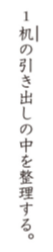
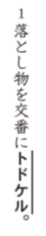
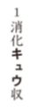

# Preguntas del Kanken 5級

## 1. Lectura de palabras
**Enunciado oficial:** 次のー線の漢字の読みをひらがなで答えのらんに書きなさい。

**Traducción:** Escribe la lectura en hiragana del kanji subrayado en el hueco de la respuesta.

**Explicación:** En este ejercicio te mostrarán multiples oraciones con un kanji subrayado y un número al lado. Tendrás que escribir **como se lee el kanji** en el contexto de esa oración. La lectura debe ser escrita en hiragana.

¿Cuál será la respuesta?

La respuesta es つくえ.

## 2. Identificación de radicales
**Enunciado oficial:** 次の漢字の部首名と部首を書きなさい。部首名は、後の囗から選んで記号で答えなさい。

**Traducción:** Escribe el nombre y el radical del kanji. El nombre del radical debes elegirlo de entre los de la caja y también elegir su símbolo.

**Explicación:** En este ejercicio te mostrarán varios kanjis, una caja con varios nombres de radicales y otra caja con los radicales como tal. Tendrás que **elegir el nombre del radical y el radical correspondiente** para cada kanji.

¿Cuáles serán las respuestas?

Las respuestas son las siguientes:
9. い（灬）
10. エ（れんが　れっか）

## 3. Identificación de trazos
**Enunciado oficial:** 次の上の漢字の太い画のところは筆順の何番目か、また総画数は何画か、算用数字で答えなさい。

**Traducción:** Indica con números arábigos el orden de trazo del trazo grueso y el número total de trazos de los kanjis.

**Explicación:** En este ejercicio tendrás que responder sobre la posición del trazo grueso y sobre el número total de trazos que tiene cada kanji.

¿Cuáles serán las respuestas?

Las respuestas son las siguientes:
1. 7
2. 8

## 4. Okurigana
**Enunciado oficial:** 次のー線のカタカナを漢字一字とおくりがな（ひらがな）に直せ。

**Traducción:** Convierte el katakana subrayado a un kanji junto con su okurigana (hiragana).

**Explicación:** En este ejercicio te mostrarán varias oraciones con una palabra escrita en katakana subrayada, en este caso no te enseñarán cuál es el kanji Tendrás que escribir **el kanji junto con su okurigana en hiragana** para formar la palabra correcta. En este ejercicio se valúa tanto la correcta escritura del kanji como la validez del okurigana.

¿Cuál será la respuesta?

La respuesta es 届ける.

## 5. Onyomi y Kunyomi
**Enunciado oficial:** 漢字の読みは音と訓があります。次のじゅく語の読みは囗の中のどの組み合わせになっていますか。ア〜エの記号で答えなさい。

**Traducción:** Los kanjis tienen lecturas onyomi y kunyomi. ¿Cuál de las combinaciones dentro de la caja corresponde a la lectura de los siguientes jukugos? Responde con el símbolo de la A a la E.

**Explicación:** En este ejercicio te mostrarán varios jukugos compuestos por dos kanjis y todas las combinaciones posibles de lecturas onyomi y kunyomi (on/on on/kun kun/on kun/kun). Tendrás que elegir la combinación correcta para cada jukugo.

¿Cuáles serán las respuestas?

Las respuestas son las siguientes:
1. ウ (kun/kun)
6. ア (on/on)

## 6. Completar palabras incompletas
**Enunciado oficial:** 次のカタカナを漢字になおして、一字だけ書きなさい。

**Traducción:** Convierte el katakana siguiente a kanji con un solo un kanji.

**Explicación:** En este ejercicio te mostrarán varias palabras con una parte escrita en katakana y tendrás que escribir **el kanji correcto** que completa esa palabra.

¿Cuál será la respuesta?

La respuesta es 吸.

## 7. Sinónimos y antónimos
**Enunciado oficial:** 後の囗の中のひらがなを漢字になおして、対義語（反対の意味のことば）と、類義語（意味がよくにたことば）を書きなさい。囗の中のひらがなは一度だけ使い、漢字一字を書きなさい。

**Traducción:** Convierte el hiragana dentro de la caja a kanji y escribe el antónimo (palabra con significado opuesto) o el sinónimo (palabra con significado similar). Cada hiragana dentro de la caja solo puede usarse una vez y debes escribir un único kanji.

**Explicación:** Este ejercicio es similar a los ejercicios de antónimos de niveles anteriores con la diferencia de que además deberás escribir los sinónimos de las palabras que así te lo pidan. Además, en lugar de ponerte la lectura en el hueco de cada palabra, te dan una única caja con varias posibles lecturas de donde deberás elegir una para cada palabra.

¿Cuál será la respuesta?

La respuesta es 展（てん）.

## 8. Composición de jukugos
**Enunciado oficial:** 後の囗の中から漢字を選んで、次の意味にあてはまる熟語を作りなさい。答えは記号で書きなさい。

**Traducción:** Elige un kanji de entre los de la caja y forma un jukugo que encaje con el significado siguiente. Escribe la respuesta con su símbolo.

**Explicación:** En este ejercicio te mostrarán varios significados, para cada significado dos cajas vacías y una caja que contiene varios kanjis. Tendrás que elegir dos kanjis de la caja para formar un jukugo que encaje con el significado que te muestran.

¿Cuál será la respuesta?

La respuesta es コ（補）ア（欠）.

## 9. Tipos de composición de jukugos
**Enunciado oficial:** 漢字を二字組み合わせたじゅく語では、二つの漢字の間に意味の上で、次のような関係があります。「」次のじゅく語は、右のア〜エのどれにあたるか、記号で答えなさい。

**Traducción:** En los jukugos compuestos por dos kanjis, existe una relación de significado entre ambos kanjis que puede describirse de estas formas: "Ejemplos". De los siguientes jukugos, ¿a cuál de las opciones de la A a la E corresponde? Escribe su símbolo.

**Explicación:** En este ejercicio te mostrarán varios jukugos compuestos por dos kanjis y 4 formas comunes de formar estos jukugos, estas formas son en resumen: significados parecidos, significados opuestos, el kanji de arriba adornando el de abajo y el kanji de abajo dando significado al de arriba. Tendrás que elegir con cuál de estas formas se ha formado cada jukugo.

¿Cuáles serán las respuestas?

Las respuestas son las siguientes:
1. イ　(significados parecidos)
6. ウ　(kanji de arriba adorna al de abajo)

## 10. Palabras con la misma lectura
**Enunciado oficial:** 次のー線のカタカナを漢字になおして答えのらんに書きなさい。

**Traducción:** Escribe el kanji correspondiente al katakana subrayado en el hueco de la respuesta.

**Explicación:** En este ejercicio te mostrarán varios grupos de frases con una parte en katakana subrayada, teniendo en común ambas frases que la lectura del kanji que falta es la misma. Tendrás que escribir el kanji correcto en el hueco de la respuesta para cada frase.

¿Cuáles serán las respuestas?

Las respuestas son las siguientes:
1. 値
2. 音

## 11. Kanjis en textos
**Enunciado oficial:** 次のー線のカタカナを漢字に直して答えのらんに書きなさい。

**Traducción:** Escribe el kanji correspondiente al katakana subrayado en el hueco de la respuesta.

**Explicación:** En este ejercicio te mostrarán multiples textos con una parte en katakana subrayada, tendrás que escribir **el kanji que compone esa palabra** en el hueco de la respuesta.

¿Cuál será la respuesta?

La respuesta es 洗.

## ¡Quiero practicar!
Hemos desarrollado una web con ejercicios basados en exámenes anteriores del Kanken de todos los niveles hasta el 2, puedes acceder a ella [dando click aquí](https://kanken.manabe.es/).