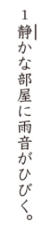
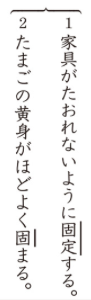
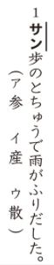
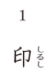
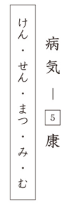
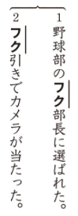

# Preguntas del Kanken 7級

## 1. Lectura de palabras
**Enunciado oficial:** 次のー線の漢字の読みをひらがなで答えのらんに書きなさい。

**Traducción:** Escribe la lectura en hiragana del kanji subrayado en el hueco de la respuesta.

**Explicación:** En este ejercicio te mostrarán multiples oraciones con un kanji subrayado y un número al lado. Tendrás que escribir **como se lee el kanji** en el contexto de esa oración. La lectura debe ser escrita en hiragana.

¿Cuál será la respuesta?

La respuesta es しず.

## 2. Diferentes lecturas del mismo kanji
**Enunciado oficial:** 次の各組のー線の感じの読みをひらがなで答えのらんに書きなさい。

**Traducción:** Escribe en hiragana la lectura común de los kanjis subrayados en cada grupo en el hueco de la respuesta.

**Explicación:** Este ejercicio es esencialmente igual que el primero, pero en este caso te mostrarán un mismo kanji en dos oraciones diferentes y tendrás que escribir **la lectura correcta para cada contexto**.

¿Cuáles serán las respuestas?

Las respuestas son las siguientes:
1. こてい
2. かた

## 3. Elegir kanji correcto de una palabra
**Enunciado oficial:** 次のー線のカタカナに合う漢字をえらんで答えのらんに記号で書きなさい。

**Traducción:** Elige el kanji correcto a la hora de escribir el katakana subrayado como kanji en las siguientes palabras.

**Explicación:** En este ejercicio te mostrarán varias frases con una parte en katakana subrayada y tres posibles kanjis para escribir esa parte. Tendrás que elegir **el kanji correcto** para cada palabra.

¿Cuál será la respuesta?

La respuesta es ウ (散歩).

## 4. Identificación de trazos
**Enunciado oficial:** 次の上の漢字の太い画のところは筆順の何番目か、下の漢字の総画数は何画か、算用数字で答えなさい。

**Traducción:** Indica con números arábigos el orden de trazo del trazo grueso de los kanjis superiores y el número total de trazos de los kanjis inferiores.

**Explicación:** A diferencia de los ejercicios de niveles anteriores, en este ejercicio tendrás que responder sobre la posición del trazo grueso solo en 5 kanjis de los 12 que te preguntan, de los otros 5 kanjis lo que deberás responder es el número total de trazos que tiene el kanji.

¿Cuáles serán las respuestas?

Las respuestas son las siguientes:
1. 5
6. 10

## 5. Onyomi y Kunyomi
**Enunciado oficial:** 次の漢字の読みは、音読み（ア）ですか、訓読み（イ）ですか。記号で答えなさい。

**Traducción:** Indica si la lectura del kanji es onyomi (A) o kunyomi (I). Responde con el símbolo correspondiente.

**Explicación:** En este ejercicio te mostrarán varios kanjis y una lectura para cada uno. Tendrás que indicar si la lectura que te muestran es **onyomi (lectura china)** o **kunyomi (lectura japonesa)**.

¿Cuál será la respuesta?

La respuesta es イ (kunyomi).

## 6. Antónimos
**Enunciado oficial:** 後の囗の中のひらがなを漢字になおして、意味が反対や対になることば（対義語）を書きなさい。囗の中のひらがなは一度だけ使い、答えのらんに漢字一字を書きなさい。

**Traducción:** Elige una lectura en hiragana de entre las que existen dentro de la caja y escríbela en forma de kanji para formar una palabra que sea antónimo o tenga un significado opuesto. Cada lectura dentro de la caja solo puede ser usada una vez y en el hueco de la respuesta debes escribir un único kanji.

**Explicación:** En este ejercicio te mostrarán pares de palabras estando una de ellas incompleta, en vez de darte la lectura del kanji que falta, te darán varias lecturas en hiragana dentro de una caja. Tendrás que elegir **la lectura correcta** para completar la palabra y escribirla en kanji en el hueco de la respuesta.

¿Cuál será la respuesta?

La respuesta es 健（けん）.

## 7. Okurigana
**Enunciado oficial:** 次のー線のカタカナを〇の中の漢字とおくりがな（ひらがな）で囗の中に書きなさい。

**Traducción:** Escribe dentro de la caja el kanji del círculo junto con su okurigana (hiragana) para el katakana subrayado.

**Explicación:** En este ejercicio te mostrarán varias oraciones con una palabra escrita en katakana subrayada y un kanji dentro de un círculo. Tendrás que escribir **el kanji del círculo junto con su okurigana en hiragana** en la caja para formar la palabra correcta. En este ejercicio se valúa tanto la correcta escritura del kanji como la validez del okurigana.

¿Cuál será la respuesta?

La respuesta es 伝える.

## 8. Kanjis con mismos radicales
**Enunciado oficial:** 次の部首のなかまの漢字で囗にあてはまる漢字一字を、答えのらんに書きなさい。

**Traducción:** Escribe el kanji que comparte componente dentro de la caja.

**Explicación:** En este ejercicio te mostrarán varias columnas cada una con un único componente de kanji en la parte superior y tres palabras incompletas debajo. Tendrás que completar las palabras escribiendo **el kanji que comparte el componente** que te muestran en la parte superior. Tienes la lectura del kanji incompleto a la derecha de cada palabra para ayudarte.

¿Cuáles serán las respuestas?

Las respuestas son las siguientes:
1. 管
2. 笑
3. 節

## 9. Palabras con la misma lectura
**Enunciado oficial:** 次のー線のカタカナを漢字になおして答えのらんに書きなさい。

**Traducción:** Escribe el kanji correspondiente al katakana subrayado en el hueco de la respuesta.

**Explicación:** En este ejercicio te mostrarán varios grupos de frases con una parte en katakana subrayada, teniendo en común ambas frases que la lectura del kanji que falta es la misma. Tendrás que escribir el kanji correcto en el hueco de la respuesta para cada frase.

¿Cuáles serán las respuestas?

Las respuestas son las siguientes:
1. 副
2. 福

## 10. Composición de jukugos
**Enunciado oficial:** 上の漢字としたの囗の中の漢字を組み合わせて二字の熟語を二つ作り、答えのらんに記号で書きかなさい。

**Traducción:** Combina el kanji de arriba con los kanjis dentro de las cajas para formar dos jukugos de dos kanjis y escríbelos en el hueco de la respuesta con los símbolos correspondientes.

**Explicación:** En este ejercicio te mostrarán una caja con 5 kanjis a elegir y 2 palabras incompletas, para cada palabra tendrás que seleccionar el kanji correcto de entre los de la caja para formar una palabra que exista.

¿Cuáles serán las respuestas?

Las respuestas son las siguientes:
1. オ (目的)
2. エ (的中)

## 11. Kanjis en textos
**Enunciado oficial:** 次のー線のカタカナを漢字に直して答えのらんに書きなさい。

**Traducción:** Escribe el kanji correspondiente al katakana subrayado en el hueco de la respuesta.

**Explicación:** En este ejercicio te mostrarán multiples textos con una parte en katakana subrayada, tendrás que escribir **el kanji que compone esa palabra** en el hueco de la respuesta.

¿Cuál será la respuesta?

La respuesta es 飛.

## ¡Quiero practicar!
Hemos desarrollado una web con ejercicios basados en exámenes anteriores del Kanken de todos los niveles hasta el 2, puedes acceder a ella [dando click aquí](https://kanken.manabe.es/).