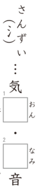
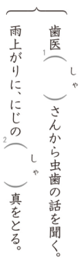

# Preguntas del Kanken 8級

## 1. Lectura de palabras
**Enunciado oficial:** つぎのー線の漢字の読みがなをー線の右に書きなさい。

**Traducción:** Escribe la lectura en kana del kanji subrayado a la derecha de la línea.

**Explicación:** En este ejercicio te mostrarán multiples oraciones con un kanji subrayado y un número al lado. Tendrás que escribir **como se lee el kanji** en el contexto de esa oración. La lectura debe ser escrita en hiragana.

¿Cuál será la respuesta?

La respuesta es 1. さむ.

## 2. Identificación de trazos
**Enunciado oficial:** つぎの漢字の太いところは何番目に書きますか。〇の中に数字を書きなさい。

**Traducción:** ¿En qué orden se escribe la parte gruesa del siguiente kanji? Escribe el número dentro del círculo.

**Explicación:** Como bien sabrás, los kanjis tienen un orden establecido para ser dibujados trazo por trazo, en este ejercicio lo que te piden es que siendo el primer trazo "1", el segundo "2" y así sucesivamente, indiques **en que posición estaría el trazo señalado con negrita** en el kanji.

¿Cuál será la respuesta?

La respuesta es 2.

## 3. Antónimos
**Enunciado oficial:** （　）の中に漢字を書いて、上とはんたいのいみのことばにしなさい。

**Traducción:** Escribe el kanji dentro del paréntesis para formar la palabra que es antónimo a la de arriba.

**Explicación:** En este ejercicio te mostrarán varias palabras escritas en kanji con un espacio en blanco representado por un paréntesis. Tendrás que escribir el kanji que falta para formar la **palabra que es antónimo** a la de arriba.

¿Cuál será la respuesta?

La respuesta es 集.

## 4. Kanjis con mismos componentes
**Enunciado oficial:** おなじなかまの漢字を囗の中に書きなさい。

**Traducción:** Escribe el kanji que comparte componente dentro de la caja.

**Explicación:** En este ejercicio te mostrarán varias columnas cada una con un único componente de kanji en la parte superior y dos palabras incompletas debajo. Tendrás que completar las palabras escribiendo **el kanji que comparte el componente** que te muestran en la parte superior. Tienes la lectura del kanji incompleto a la derecha de cada palabra para ayudarte.

¿Cuáles serán las respuestas?

Las respuestas son las siguientes:
1. 温
2. 波

## 5. Palabras con la misma lectura
**Enunciado oficial:** つぎの（　）の中に漢字を書きなさい。

**Traducción:** Escribe el kanji dentro del paréntesis.

**Explicación:** En este ejercicio te mostrarán varios grupos de frases con un espacio en blanco representado por un paréntesis, teniendo en común ambas frases que la lectura del kanji que falta es la misma. Tendrás que escribir el kanji correcto dentro del paréntesis para cada frase.

¿Cuáles serán las respuestas?

Las respuestas son las siguientes:
1. 者
2. 写

## 6. Okurigana
**Enunciado oficial:** つぎのー線のカタカナを〇の中の漢字とおくりがな（ひらがな）で囗の中に書きなさい。

**Traducción:** Escribe dentro de la caja el kanji del círculo junto con su okurigana (hiragana) para el katakana subrayado.

**Explicación:** En este ejercicio te mostrarán varias oraciones con una palabra escrita en katakana subrayada y un kanji dentro de un círculo. Tendrás que escribir **el kanji del círculo junto con su okurigana en hiragana** en la caja para formar la palabra correcta. En este ejercicio se valúa tanto la correcta escritura del kanji como la validez del okurigana.

¿Cuál será la respuesta?

La respuesta es 定める.

## 7. Diferentes lecturas del mismo kanji
**Enunciado oficial:** つぎのー線の漢字のよみがなをー線の右に書きなさい。

**Traducción:** Escribe la lectura en kana del kanji subrayado a la derecha de la línea.

**Explicación:** Este ejercicio es esencialmente igual que el primero, pero en este caso te mostrarán un mismo kanji en dos oraciones diferentes y tendrás que escribir **la lectura correcta para cada contexto**. La diferencia con otros niveles es que ahora además del kanji en común te pueden preguntar por la lectura de una palabra entera que lo componga.

¿Cuáles serán las respuestas?

Las respuestas son las siguientes:
1. こうそく
2. はや

## 8. Kanjis en textos
**Enunciado oficial:** つぎの囗の中に漢字をかきなさい。

**Traducción:** Escribe el kanji dentro de cada caja.

**Explicación:** En este ejercicio te mostrarán multiples textos con multiples cajas con la lectura de la palabra a la derecha, tendrás que escribir **el kanji que compone esa palabra** en cada caja.

¿Cuáles serán las respuestas?

Las respuestas son las siguientes:
1. 育
2. 員

## ¡Quiero practicar!
Hemos desarrollado una web con ejercicios basados en exámenes anteriores del Kanken de todos los niveles hasta el 2, puedes acceder a ella [dando clic aquí](https://kanken.manabe.es/).