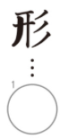
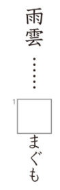
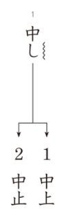
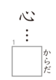

# Preguntas del Kanken 9級

## 1. Lectura de palabras
**Enunciado oficial:** つぎの文をよんで、ーせんの漢字のよみがなをーせんの右にかきなさい。

**Traducción:** Lee las siguientes oraciones y escribe la lectura en kana del kanji subrayado a la derecha de la línea.

**Explicación:** En este ejercicio te mostrarán un par de oraciones con varios kanjis subrayados y con un número al lado. Tendrás que escribir **como se lee el kanji** en el contexto de esa oración. La lectura debe ser escrita en hiragana.

¿Cuáles serán las respuestas?

Las respuestas son las siguientes:
1. き
2. こうつう
3. おし

## 2. Identificación de trazos
**Enunciado oficial:** つぎの漢字のふといところはなんばんめに書きますか。〇の中にすう字をかきなさい。

**Traducción:** ¿En qué orden se escribe la parte gruesa del siguiente kanji? Escribe el número dentro del círculo.

**Explicación:** Como bien sabrás, los kanjis tienen un orden establecido para ser dibujados trazo por trazo, en este ejercicio lo que te piden es que siendo el primer trazo "1", el segundo "2" y así sucesivamente, indiques **en que posición estaría el trazo señalado con negrita** en el kanji.

¿Cuál será la respuesta?

La respuesta es 3.

## 3. Completar lecturas de kanji
**Enunciado oficial:** 囗にひらがなを一字かいて、つぎのことばのよみをこたえなさい。

**Traducción:** Completa las lecturas de los siguientes kanjis con un caracter hiragana.

**Explicación:** En este ejercicio te mostrarán varias palabras escritas en kanji y su lectura con uno o varios espacios en blanco, tendrás que escribir **el caracter hiragana que falta** para completar la lectura correcta de cada palabra.

¿Cuál será la respuesta?

La respuesta es あ.

## 4. Tome/hane
**Enunciado oficial:** 〇のところは、はねるか、とめるか、正しいかきかたで〇の中にかきなさい。

**Traducción:** Escribe dentro del círculo si en el trazo oculto se debe hacer un "tome" (detener el trazo) o un "hane" (levantar el pincel al final del trazo).

**Explicación:** No sé si estás familiarizado con el concepto de "tome" y "hane", pero básicamente son dos formas de terminar un trazo al escribir kanjis. En este ejercicio te mostrarán varios kanjis con un trazo oculto y tendrás que indicar **si ese trazo se debe terminar con un tome o con un hane**.

En el caso de esta imagen, el último trazo del kanji de la izquierda ha sido terminado con un tome y el de la derecha con un "hame", la forma correcta de escribirlo es la de la izquierda.

¿Cuál será la respuesta?

La respuesta es はねる. (弓

## 5. Diferentes lecturas del mismo kanji
**Enunciado oficial:** つぎの文をよんで、ーせんの漢字のよみがなをーせんの右に書きなさい。

**Traducción:** Lee las siguientes oraciones y escribe la lectura en kana del kanji subrayado a la derecha de la línea.

**Explicación:** Este ejercicio es esencialmente igual que el primero, pero en este caso te mostrarán un mismo kanji en dos oraciones diferentes y tendrás que escribir **la lectura correcta para cada contexto**.

¿Cuáles serán las respuestas?

Las respuestas son las siguientes:
1. しん
2. あたら

## 6. Elegir kanji correcto de una palabra
**Enunciado oficial:**　つぎのーせんのひらがなを漢字でかくと、どちらが正しいですか。正しいほうのばんごうに〇をつけなさい。

**Traducción:** Elige el kanji correcto a la hora de escribir el hiragana subrayado como kanji en las siguientes palabras.

**Explicación:** En este ejercicio te mostrarán varias palabras con una parte en hiragana subrayada y dos posibles kanjis para escribir esa parte. Tendrás que elegir **el kanji correcto** para cada palabra.

¿Cuál será la respuesta?

La respuesta es 2. (中止)

## 7. Kanjis con mismos componentes
**Enunciado oficial:** おなじなかまの漢字を囗の中にかきなさい。

**Traducción:** Escribe el kanji que comparte componente dentro de la caja.

**Explicación:** En este ejercicio te mostrarán varias columnas cada una con un único componente de kanji en la parte superior y dos palabras incompletas debajo. Tendrás que completar las palabras escribiendo **el kanji que comparte el componente** que te muestran en la parte superior. Tienes la lectura del kanji incompleto a la derecha de cada palabra para ayudarte.

¿Cuáles serán las respuestas?

Las respuestas son las siguientes:
1. 国
2. 回

## 8. Palabras relacionadas
**Enunciado oficial:** 次の囗の中に漢字を書きなさい。

**Traducción:** Escribe el kanji dentro de cada caja.

**Explicación:** En este ejercicio te mostrarán varias palabras y un cuadro asociado a cada una con una lectura a su derecha, deberás escribir **una palabra con esa lectura que además esté relacionada con la palabra** que te muestran.

¿Cuál será la respuesta?

La respuesta es 体.

## 9. Kanjis en textos
**Enunciado oficial:** つぎの文をよんで、囗の中に漢字をかきなさい。

**Traducción:** Lee el siguiente texto y escribe el kanji que falta en cada caja.

**Explicación:** En este ejercicio te mostrarán multiples textos con multiples cajas con la lectura de la palabra a la derecha, tendrás que escribir **el kanji que compone esa palabra** en cada caja.

¿Cuáles serán las respuestas?

Las respuestas son las siguientes:
1. 算
2. 数
3. 黒
4. 書

## ¡Quiero practicar!
Hemos desarrollado una web con ejercicios basados en exámenes anteriores del Kanken de todos los niveles hasta el 2, puedes acceder a ella [dando clic aquí](https://kanken.manabe.es/).