# Preguntas del Noken/JLPT

Esta página estará divida según las secciones del examen, dentro de cada sección habrá diferentes apartados con cada una de las preguntas que salen en el examen.

!!! note Preguntas y niveles
    Al lado del nombre de cada pregunta pondré todos los niveles en los que esta pregunta aparece. Por ejemplo, si una pregunta aparece en el N5 y en el N4, pondré N5/N4.

## <ruby>文字<rt>もじ</rt></ruby>・<ruby>語彙<rt>ごい</rt></ruby> (Vocabulario)

### <ruby>漢字<rt>かんじ</rt>読<rt>よ</rt><ruby>み (Lectura de Kanjis) N5/N4/N3/N2/N1

Enunciado oficial: _____の言葉の読み方として最もよいものを、１・２・３・４から一つ選びなさい。
Traducción: Elige la lectura apropiada para la palabra que aparece subrayada entre las opciones 1, 2, 3 y 4.

Explicación: Es un ejercicio fácil de entender, te van a poner una frase y una de las palabras de esta frase va a aparecer subrayadada tal que así:

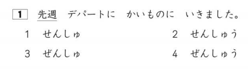

Va a pillar eh? Aquí lo que tienes que hacer es seleccionar la lectura que es correcta para **先週**. Por inmersión te sonará que suena parecido a "sensu", pero como puedes ver el examen no es tan fácil y todas las respuestas son parecidas así que pon especial cuidado en anki a la hora de corregirte!

¿Cuál será la respuesta?

La respuesta correcta es la 2, せんしゅう.

### <ruby>表記<rt>ひょうき</rt></ruby> (ortografía) N5/N4/N3/N2

Enunciado oficial: ＿＿＿の言葉を漢字で書くとき、最もよいものを１・２・３・４から一つ選びなさい。
Traducción: Elige la escritura correcta en kanji para la palabra que aparece subrayada entre las opciones 1, 2, 3 y 4.

Explicación: Este puedes pensar que es como el anterior pero al revés, te van a poner una frase de igual forma, pero ahora la palabra subrayada va a estar en hiragana y tú tienes que elegir la escritura correcta en kanji (o katakana para el N5):

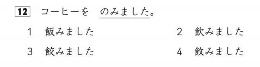

Aquí también se parecen bastante las respuestas como puedes ver, confía en tu instinto y selecciona la que creas que es correcta. Aquí te están preguntando cual es el kanji correcto para のみました.

¿Cuál será la respuesta?

La respuesta correcta es la 2, 飲みました.

### <ruby>語形成<rt>ごけいせい</rt></ruby> (Formación de palabras) N2

Este ejercicio es muy de nicho ya que solo aparece en el N2, si quieres presentarte a cualquier otro nivel puedes ignorarlo.

Enunciado oficial: （　　　）に入れるのに最もよいものを、１・２・３・４から一つ選びなさい。
Traducción: Elige la palabra que mejor encaje en el hueco en blanco entre las opciones 1, 2, 3 y 4.

Explicación: En este ejercicio te van a dar una ""palabra compuesta"" a medias y lo que tienes que hacer es elegir lo que más sentido tenga en el hueco de la frase:

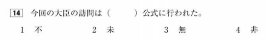

Este ejercicio es bastante más complicado que los dos anteriores, pero también es comprensible dado que este forma parte del N2 que es el segundo nivel más alto. En este ejercicio tienes que buscar la opción que tiene más sentido para la palabra acabada en 公式 y el significado que aporta a la frase.

¿Cuál será la respuesta?

La respuesta correcta es la 4, 非.

Ni 不公式　ni 未公式 ni 無公式 existen, pero cuidado que a veces te ponen palabras que si existen pero no tienen el significado que buscas.

### <ruby>文脈規定<rt>ぶんみゃくきてい</rt></ruby> (Expresiones definidas por contexto) N5/N4/N3/N2/N1

Enunciado oficial: _____に入れるのに最もよいものを、１・２・３・４から一つ選びなさい。
Traducción: Elige la palabra que mejor encaje en el hueco en blanco entre las opciones 1, 2, 3 y 4.

Explicación: Aunque el enunciado sea el mismo que el ejercicio anterior, este es diferente. Al igual que el otro, te dan una frase con un hueco y tienes que elegir una opción pero en este caso tienes que elegir la palabra que más pegue con el contexto de la frase, es decir, tienes que entender la frase y elegir la palabra que se usaría en ese contexto.

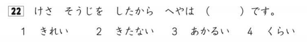

No es un ejercicio muy complicado si inmersas a menudo ya que simplemente tienes que entender lo que la frase quiere decir y descartar opciones.

¿Cuál será la respuesta?

La respuesta correcta es la 1, きれい.

Sabiendo que la frase quiere decir "ayer limpié mi habitación, por lo que quedó _____", podemos descarta la 3 y la 4 ya que limpiar la habitación no afecta a que le entre más o menos luz (en situaciones normales, tampoco te comas la cabeza con el caso en el que las ventanas estaban llenas de roña por lo tanto ahora entra más luz). Ahora tenemos la 2, que significa sucio; y la 1, que significa limpio/bonito; por lo que la respuesta correcta es la 1.

 

### <ruby>言<rt>い</rt>い換え<rt>か</rt>類義<rt>るいぎ</rt></ruby> (Parafraseo) N5/N4/N3/N2/N1

Enunciado oficial: _____の言葉に意味が最も近ものを、１・２・３・４から一つ選びなさい。
Traducción: Elige la palabra que más se acerque en significado a la palabra subrayada entre las opciones 1, 2, 3 y 4.

Explicación: En este caso no tienes huecos en blanco, si no que volvemos a las palabras subrayadas. Entre las cuatro opciones que te dan tienes que elegir la que tenga un significado más parecido a la palabra subrayada **en el contexto de la frase**. En el caso de los niveles más bajos, en vez de palabras te pueden subrayar la frase entera y deberás seleccionar la frase que más se parezca, pondré un ejemplo de ambos casos.

N5/N4
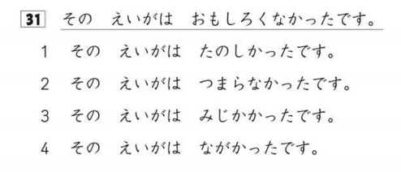

N3/N2/N1
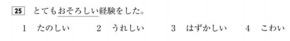

¿Cuál será la respuesta?

**Ejercicio fácil**: La respuesta correcta es la 2. En el enunciado te dicen que no era divertida así que lo más parecido en significado es que era aburrida.

**Ejercicio difícil**: La respuesta correcta es la 4. La palabra más parecida a おそろしい es こわい. En este caso es bastante obvio pero ten cuidado en niveles más complicados que te ponen palabras muy parecidas.

### <ruby>用法<rt>ようほう</rt></ruby> (Uso de palabras) N4/N3/N2/N1

Enunciado oficial: 次の言葉の使い方として最もよいものを、１・２・３・４から一つ選びなさい。
Traducción: Elige la forma correcta de usar la palabra que aparece subrayada entre las opciones 1, 2, 3 y 4.

Explicación: Personalmente me parece de los ejercicios más difíciles del examen. Te van a poner una palabra y cada opción va a ser una frase que utilice esa palabra. Tres de estas frases van a usarla de forma incorrecta y tú tienes que marcar la opción que use la palabra correctamente.

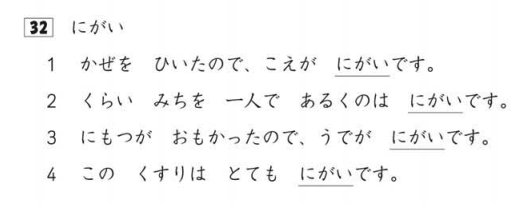

Aquí te están preguntando cual de esas frases utiliza にがい correctamente.

¿Cuál será la respuesta?

La respuesta correcta es la 4.

La primera dice que tu voz se ha vuelto amarga, lo cual no tiene sentido.
La segunda habla de que andar solo es amargo, esta opción puede despistar un poco ya que existe la construcción <ruby>苦手<rt>にがて</rt></ruby>です que si sería apropiada para esta frase, pero no es el caso, cuidado.
La tercera opción dice que al cargar cosas pesadas tu brazo se ha vuelto amargo, lo cual tampoco tiene sentido.
Finalmente la cuarta opción habla de lo amarga que es una medicina.

## <ruby>文法<rt>ぶんぽう</rt></ruby> (Gramática)

### <ruby>文<rt>ぶん</rt></ruby>の<ruby>文法<rt>ぶんぽう</rt></ruby>1（<ruby>文法形式<rt>ぶんぽうけいしき</rt></ruby>の<ruby>判断<rt>はんだん</rt>）</ruby> (Gramática de frases, selección de forma gramatical) N5/N4/N3/N2/N1

Enunciado oficial: 次の文の_____に入れるのに最もよいものを、１・２・３・４から一つ選びなさい。
Traducción: Elige la forma gramatical correcta para el hueco en blanco de la frase entre las opciones 1, 2, 3 y 4.

Explicación: Un ejercicio también sencillo de entender, te dan una frase con un hueco y tienes que poner la forma gramátical que mejor encaje en el hueco. En el caso del N5 está especialmente orientado a las particulas así que estudiatelas bien!

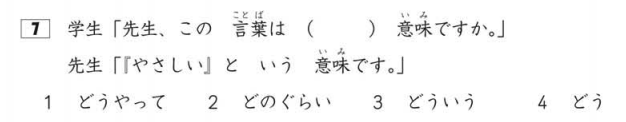

Estos ejercicios solo hay dos formas de resolverlos correctamente, o te has empollado la gramática bien y te sabes todas las reglas gramáticales, o has inmersado muchísimo y te suena raro si algo no encaja.

¿Cuál será la respuesta?

La respuesta correcta es la 3, どういう.

Explicado así rápidamente y a lo burro, cada una de las opciones sería esto:
1. cómo
2. cuánto
3. cuál
4. cómo

y como la pregunta dice "_____ es el significado de esta palabra", pues estaría claro.

### <ruby>文<rt>ぶん</rt></ruby>の<ruby>文法<rt>ぶんぽう</rt></ruby>1（<ruby>文<rt>ぶん</rt></ruby>の<ruby>組<rt>く</rt></ruby>み<ruby>立<rt>た</rt></ruby>て）</ruby> (Gramática de frases, composición de frases) N5/N4/N3/N2/N1

Enunciado oficial: 次の文の＿★＿に入れる最も良いものを、１・２・３・４から一つ選びなさい。
Traducción: Elige la opción que mejor encaje en el hueco señalado con ★ de la frase entre las opciones 1, 2, 3 y 4.

Explicación: Este ejercicio es bastante difícil de entender de primeras así que intentaré esforzarme para explicarlo bien. Básicamente te dan una frase con **cuatro huecos**, uno de estos huecos está representado con una estrella y luego tienes cuatro opciones como de costumbre.
Cada una de estas opciones son partes de la frase del enunciado y lo que tienes que señalar como respuesta es la parte **que va en el hueco señalado con la estrella**.

Explicandolo con números, imaginate que te dan esta secuencia: 2, 4, 6, _, _, ★, _, 16, 18. y las opciones son 8, 10, 12 y 14. La respuesta correcta sería 12 ya que es la que va en el hueco señalado con la estrella.

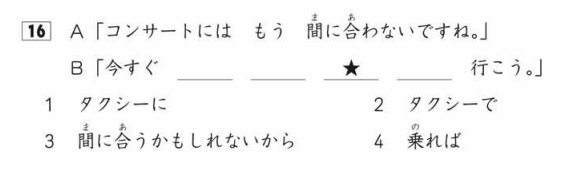

Es común que te pongan conversaciones para que entiendas bien el contexto de la frase.

¿Cuál será la respuesta?

La respuesta correcta es la 3, 間に合うかもしれないから.

La frase entera sería: "今すぐ | タクシーに | 乗れば | **間に合うかもしれないから** | タクシーで | 行こう。" que significa "Si cogemos un taxi ahora mismo, quizás lleguemos a tiempo, así que vamos en taxi." así que, ya que el cuadrado marcado con la estrella es el terecer hueco de la frase, la respuesta correcta es la 3.

### <ruby>文章<rt>ぶんしょう</rt></ruby>の<ruby>文法<rt>ぶんぽう</rt></ruby>

Enunciado oficial: XX から YY に何を入れますか。文章の意味を考えて、１・２・３・４から一番いいものを一つ選んでください。
Traducción: ¿Qué pondrías en el hueco de XX a YY? Piensa en el significado de la frase y elige la mejor opción entre las opciones 1, 2, 3 y 4.

Explicación: Este ejercicio es muuuy largo, te van a dar un texto con varios huecos en blanco y tienes que ir eligiendo las opciones que mejor encajen en el texto para cada uno de estos huecos. Básicamente es como el ejercicio de selección de forma gramatical pero a lo grande.

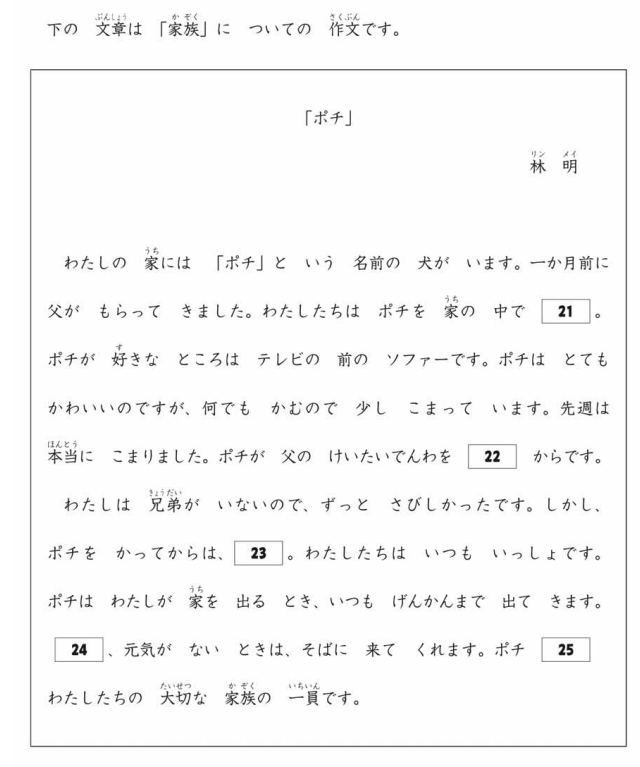

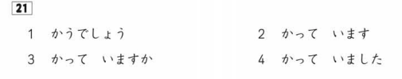

Como el ejercicio es muy grande solo voy a resolver el cuadrado 21.

¿Cuál será la respuesta?

La respuesta correcta es la 2. かっています.

En el texto habla del perro en el presente "犬がいます", por lo tanto la opción más lógica sería la que usa la misma forma temporal.

## <ruby>読解<rt>どっかい</rt></ruby> (Comprensión de lectura)

### <ruby>内容理解<rt>ないようりかい</rt></ruby>（<ruby>短文<rt>たんぶん</rt></ruby>） (Comprensión lectora, textos cortos) N5/N4/N3/N2/N1
### <ruby>内容理解<rt>ないようりかい</rt></ruby>（<ruby>中文<rt>ちゅうぶん</rt></ruby>） (Comprensión lectora, textos cortos) N5/N4/N3/N2/N1
### <ruby>内容理解<rt>ないようりかい</rt></ruby>（<ruby>長文<rt>ちょうぶん</rt></ruby>） (Comprensión lectora, textos cortos) N3/N1

En estos ejercicios de lectura no voy a explicar mucho, te ponen textos y tienes que responder preguntas sobre ellos. Esta clase de ejercicios solo se pueden afrontar inmersando mucho, especialmente la lectura, así que no la descuides.

La respuesta **siempre** está en el texto, no te calientes la cabeza porque vas a ir mal de tiempo y seguramente saques conclusiones erroneas o directamente no te de tiempo a terminar la sección.

### <ruby>統合理解<rt>とうごうりかい</rt></ruby> (Comprensión integrada) N2/N1

Este es un ejercicio curioso que solo sale en los niveles más altos, te van a poner un texto A y un texto B hablando del mismo tema. Después te van a hacer preguntas donde comparan los dos textos y te preguntan cosas como "¿Qué piensa el autor del texto A sobre X?" o "¿Qué tema toca el texto A que no toca el texto B?"

### <ruby>主張理解<rt>しゅちょうりかい</rt></ruby>（<ruby>長文<rt>ちょうぶん</rt></ruby>）(Comprensión temática, textos largos) N2/N1

Aquí te ponen un texto un poquito más abstracto y te hacen preguntas sobre lo que el autor estaba pensado al escribirlo o cual es su punto de vista sobre ciertos temas.

### <ruby>情報検索<rt>じょうほうけんさく</rt></ruby> (Búsqueda de información) N5/N4/N3/N2/N1

Este ejercicio la verdad que parece una tontería pero yo creo que es bastante importante si vas a vivir en Japón. Te van a poner texto en un formato en el que vas a tener que buscar información concreta, por ejemplo: un horario de trenes, un flyer de un concierto, un correo corporativo, una tabla de precios... y te van a hacer preguntas concretas sobre estos textos.

Por ejemplo, te ponen un horario de autobuses donde se pueden ver las ciudades por donde pasan y las horas a las que pasan. Te podrían preguntar "A qué hora pasa el bus A por la ciudad B?" o "Cuánto cuesta el billete de la ciudad C a la ciudad D?".

En mi opinión es un ejercicio fácil, pero es el último de la sección de lectura así que si lo has dejado para el final y vas muy pillado de tiempo igual no lo terminas, ojo con esto.

## <ruby>聴解<rt>ちょうかい</rt></ruby> (Comprensión auditiva)

!!! note Toma apuntes!
    En la sección de comprensión auditiva te dejan tomar apuntes, aprovecha la oportunidad y apunta palabras clave sobre la pregunta que te han hecho inicialmente y las cosas que van saliendo en cada conversación.

    Es **muy** importante ya que te pueden preguntar cosas como "que hay a la izquierda de la mesa?" y tú has entendido perfectamente la conversación pero no te acuerdas si en la pregunta te decían izquierda o derecha. Sé listo!

### <ruby>課題理解<rt>かだいりかい</rt></ruby> (Comprensión de tareas) N5/N4/N3/N2/N1

Te van a poner una conversación y te van a hacer una pregunta sobre ella **antes de ponerte el audio**, deberás escuchar la conversación, entender lo que dicen y seleccionar la respuesta correcta.

### ポイント<ruby>理解<rt>りかい</rt></ruby> (Comprensión de puntos clave) N5/N4/N3/N2/N1

Es como el anterior, en vez de hacerte preguntas sobre la comprensión general de la conversación, serán preguntas sobre algo más concreto. En este ejercicio es especialmente importante tomar apuntes sobre la pregunta que te hagan.

### <ruby>概要理解<rt>がいようりかい</rt></ruby> (Comprensión general) N3/N2/N1

Este ejercicio es como el anterior pero con una diferencia clave, **no te van a decir la pregunta con antelación**, es decir, primero vas a tener que escuchar la conversación y captar los puntos que creas clave y al acabar la conversación te van a hacer una pregunta sobre algo que hayan dicho.

Este es bastante hit or miss, como no hayas cogido bien el punto del que trata la pregunta la has cagado. Importantes los apuntes.

### <ruby>発話表現<rt>はつわひょうげん</rt></ruby> (Expresión oral) N5/N4/N3

En este ejercicio te van a poner un dibujo con una situación y van a reproducir 3 audios con posibles expresiones que se dirían en ese contexto, tienes que elegir la expresión que más encaje con la situación.

Por ejemplo, la situación es un hombre volviendo a su casa y las opciones son "おかえり", "ただいま" y "こんばんは", pues la respuesta sería "ただいま".

### <ruby>即時応答<rt>そくじおうとう</rt></ruby> (Respuesta inmediata) N5/N4/N3/N2/N1

Exactamente lo mismo que el anterior pero en vez de ser una situación, es una respuesta a algo que te dicen y aquí no hay dibujo.

Así como ejemplo relacionado con el anterior, te podrían poner como audio al hombre diciendo "ただいま" y a su mujer respondiendo "おかえり", "ただいま" o "こんばんは", la respuesta correcta sería "おかえり".

### <ruby>統合理解<rt>とうごうりかい</rt> (Comprensión integrada) N2/N1

En este ejercicio te van a poner dos conversación muuuy largas, estamos hablando de un "fragmento" de un programa de radio o un debate entre dos personas. Aquí como no tomes apuntes estás vendido porque no puedes memorizar todo de lo que hablen.

La primera parte te hará una pregunta general sobre la conversación, generalmente relacionada con la conclusión a la que han llegado o algún punto interesante.

En la segunda parte normalmente te comparan múltiples cosas de las dos conversaciones y te preguntan cosas como "¿Qué piensa la persona A sobre X?" o "¿Qué producto prefiere la persona B?".

## ¡Quiero practicar!
Hemos desarrollado una web con ejercicios basados en exámenes anteriores del Noken de todos los niveles, puedes acceder a ella [dando click aquí](https://jlpt.manabe.es/).

Esta página solo contiene ejercicios sobre la primera parte del examen (vocabulario y gramática), si quieres practicar las otras dos secciones te recomiendo que busques exámenes anteriores en internet y los hagas, en youtube hay algún que otro vídeo con exámenes completos resueltos.